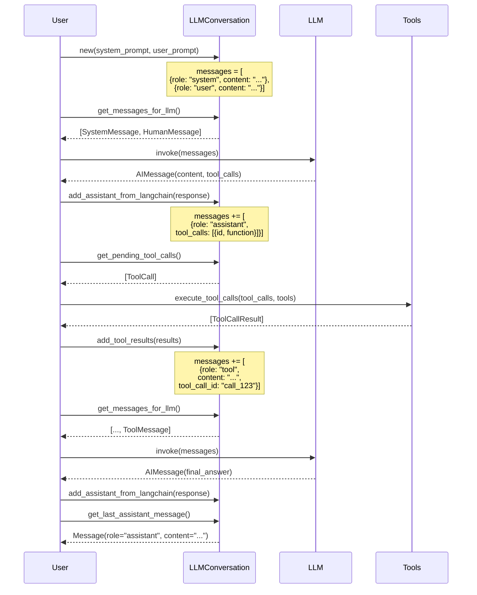
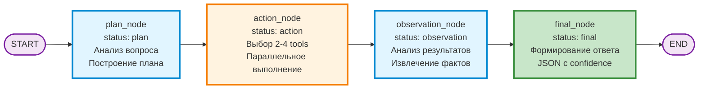
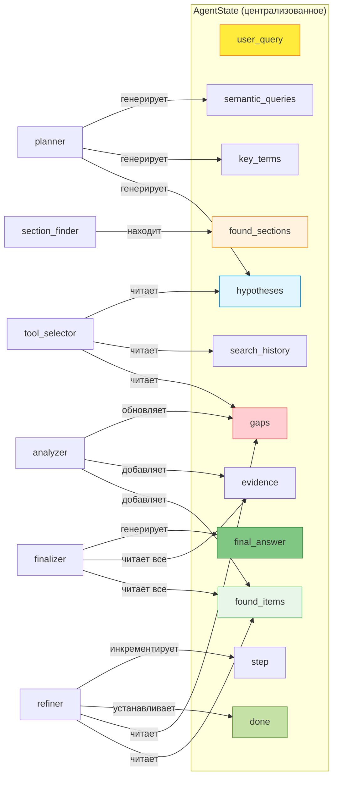
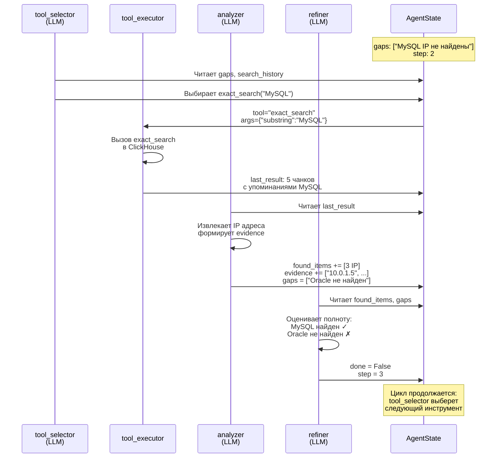

# RAG — Retrieval-Augmented Generation по документации

Консольный чат по корпусу документов `.md` с тремя режимами работы: базовый чат, многошаговый пайплайн и свободный агент с инструментами.

Стек: **Ollama** (LLM + эмбеддинги) · **ClickHouse** (векторное хранилище) · **LangChain 1.x** (ReAct агент с tool calling) · **live streaming** токенов LLM в реальном времени.

---

## 💬 Формат общения с LLM

Система использует структурированный формат **messages** для взаимодействия с LLM (новый подход с явной историей):

```python
{
    "SYSTEM_PROMPT": "ты ассистент, твоя задача....",
    "USER_PROMPT": "я как пользователь хочу найти...",
    "available_tools": [...],  # JSON tools в известном формате
    "messages": [
        {"role": "system", "content": SYSTEM_PROMPT},                          # 1
        
        {"role": "user", "content": "какие СУБД упоминаются в документации"}, # 2  ← исходный запрос
        
        {"role": "assistant", "content": "Чтобы ответить, мне нужно поискать...", 
         "tool_calls": [{"id": "call_123", "function": {"name": "tool_search_docs", "arguments": {...}}}] },  # 3
        
        {"role": "tool", 
         "content": "Найдено: PostgreSQL упоминается в разделе 3.2, MySQL в 4.1, MongoDB в примерах...", 
         "tool_call_id": "call_123"},                                         # 4  ← результат инструмента (existing_context)
        
        {"role": "assistant", "content": "Я вижу упоминания PostgreSQL и MySQL. Нужно проверить, есть ли ещё..."}, # 5
        
        {"role": "tool", 
         "content": "Дополнительно найдено: SQLite в разделе о лёгких окружениях...", 
         "tool_call_id": "call_456"}                                          # 6  ← второй раунд поиска
    ]
}
```

### Роли сообщений

- **system**: Системный промпт - задаёт роль и инструкции для LLM
- **user**: Запрос пользователя
- **assistant**: Ответ LLM, может содержать `tool_calls` для вызова инструментов
- **tool**: Результат выполнения инструмента, содержит `tool_call_id` для связи с `assistant.tool_calls`

### Модуль llm_messages.py

Централизованный модуль для работы с messages:

```python
from llm_messages import LLMConversation, execute_tool_calls

# Создаём диалог
conv = LLMConversation(
    system_prompt="Ты ассистент для поиска в документации",
    user_prompt="найди все СУБД",
    available_tools=tools,
)

# Вызываем LLM
response = llm.invoke(conv.get_messages_for_llm())
conv.add_assistant_from_langchain(response)

# Выполняем tool calls если есть
if conv.has_pending_tool_calls():
    tool_calls = conv.get_pending_tool_calls()
    results = execute_tool_calls(tool_calls, tools)
    conv.add_tool_results(results)
    
    # Следующий раунд с LLM
    response = llm.invoke(conv.get_messages_for_llm())
    conv.add_assistant_from_langchain(response)

# Финальный ответ
print(conv.get_last_assistant_message().content)
```

### Преимущества нового формата

- ✅ **Полная история диалога** в одном объекте
- ✅ **Прозрачность tool calls** - явная связь запрос→результат через `tool_call_id`
- ✅ **Возможность отладки** - полная трассировка всех шагов
- ✅ **Единый формат** для всех агентов (rag_agent, rag_lg_agent)
- ✅ **Переиспользование контекста** - история сохраняется между раундами

### Пример использования

Полный рабочий пример многораундового поиска с tool calls:
```bash
python example_llm_messages.py
```

См. файл [`example_llm_messages.py`](./example_llm_messages.py) для демонстрации:
- Создание диалога с system prompt
- Первый вызов LLM с tool calling
- Выполнение инструментов
- Добавление результатов в историю
- Финальный ответ LLM с учётом всего контекста

### API модуля llm_messages.py

**LLMConversation** - основной класс для работы с диалогом:
- `__init__(system_prompt, user_prompt, available_tools)` - создание диалога
- `add_user_message(content)` - добавить user message
- `add_assistant_from_langchain(message)` - добавить assistant message из LangChain AIMessage
- `add_tool_result(tool_call_id, tool_name, result)` - добавить результат одного инструмента
- `add_tool_results(results)` - добавить результаты нескольких инструментов
- `get_messages_for_llm()` - конвертация в LangChain BaseMessage формат для invoke
- `has_pending_tool_calls()` - проверка наличия невыполненных tool calls
- `get_pending_tool_calls()` - получение списка невыполненных tool calls
- `get_last_assistant_message()` - последнее сообщение ассистента
- `format_for_display()` - форматирование истории для логов

**execute_tool_calls(tool_calls, tools)** - выполнение списка tool calls и возврат результатов

**convert_langchain_tools_to_json(tools)** - конвертация LangChain tools в JSON Schema формат

### Диаграмма последовательности



---

## Общий дизайн

### Слои системы

```
┌─────────────────────────────────────────────────────────────────────────┐
│  СЛОЙ ПОЛЬЗОВАТЕЛЯ                                                      │
│                                                                         │
│   rag_chat.py          rag_agent.py          rag_lc_agent.py            │
│   Базовый чат          Пайплайн-агент        LangChain-агент            │
│   (1 поиск → LLM)      (фиксированные шаги)  (ReAct + expansion + eval)│
└────────┬───────────────────────┬──────────────────────┬─────────────────┘
         │                       │                      │
         │                       │              ┌───────▼────────────────┐
         │                       │              │  kb_tools.py           │
         │                       │              │  14 LangChain Tools:   │
         │                       │              │  semantic_search       │
         │                       │              │  exact_search          │
         │                       │              │  exact_search_in_file  │
         │                       │              │  exact_search_in..._section│
         │                       │              │  multi_term_exact      │
         │                       │              │  find_sections_by_term │
         │                       │              │  find_relevant_sections│
         │                       │              │  regex_search          │
         │                       │              │  read_table            │
         │                       │              │  get_section_content   │
         │                       │              │  list_sections         │
         │                       │              │  get_neighbor_chunks   │
         │                       │              │  list_sources          │
         │                       │              │  list_all_sections     │
         └─────────────┬─────────┘              └───────┬────────────────┘
                       │                                │
         ┌─────────────▼────────────────────────────────▼─────────────────┐
         │  clickhouse_store.py  — ClickHouseVectorStore                  │
         │                                                                 │
         │  similarity_search()    cosineDistance(embedding, query_vec)   │
         │  exact_search()         positionCaseInsensitive(content, sub)  │
         │  get_neighbor_chunks()  line_start < anchor ORDER BY DESC      │
         │  clone()                независимый HTTP-клиент на поток       │
         └─────────────────────────────┬───────────────────────────────────┘
                                       │
         ┌─────────────────────────────▼───────────────────────────────────┐
         │  ClickHouse  soib_kcoi_v2.chunks                                │
         │                                                                 │
         │  ENGINE = ReplacingMergeTree ORDER BY (source, section,        │
         │           chunk_type, cityHash64(content))                     │
         │                                                                 │
         │  id · source · section · chunk_type · table_headers            │
         │  content · embedding(Array(Float32)) · line_start · line_end   │
         └─────────────────────────────────────────────────────────────────┘

         ┌─────────────────────────────────────────────────────────────────┐
         │  md_splitter.py  — индексация .md → Documents                  │
         │                                                                 │
         │  ""             prose size-split фрагмент (для поиска)         │
         │  paragraph_full полный блок (контекст)                         │
         │  table_row      одна строка таблицы как JSON-массив            │
         │  table_full     вся таблица raw (контекст)                     │
         │  table_raw      непарсируемая taблица verbatim                 │
         └─────────────────────────────────────────────────────────────────┘

         ┌─────────────────────────────────────────────────────────────────┐
         │  Ollama                                                         │
         │  LLM:         qwen3:8b  (генерация + tool calling)             │
         │  Эмбеддинги:  bge-m3   (1024-мерные векторы)                  │
         └─────────────────────────────────────────────────────────────────┘
```

### Четыре режима работы

| Режим | Файл | Стратегия | Когда использовать |
|---|---|---|---|
| **Базовый чат** | `rag_chat.py` | 1 semantic search → LLM | Быстрые концептуальные вопросы |
| **Пайплайн-агент** | `rag_agent.py` | Фиксированные шаги: анализ → N поисков → rerank → обогащение → синтез | Сложные вопросы, таблицы, списки |
| **LangChain-агент** | `rag_lc_agent.py` | LLM сам выбирает из 9 tools, один проход с query expansion + evaluation + streaming | Рекомендуется для всех типов вопросов |
| **LangGraph-агент** 🔄 | `rag_lg_agent.py` | **Single-pass** state machine: plan_node → action_node (2-4 tools параллельно) → observation_node → final_node. Следует `system_prompt.md`, полное логирование messages [📖 Документация](./doc/RAG_LG_AGENT_V2.md) | Структурированный поиск с JSON-ответами, полное логирование всех LLM взаимодействий |
| **Single-pass агент** 🆕 | `rag_single_pass_agent.py` | Линейный граф без итераций: query_analyzer → tool_executor (2-4 tools параллельно) → data_analyzer → answer_generator → answer_evaluator [📖 Документация](./doc/SINGLE_PASS_AGENT.md) | Быстрые запросы с автооценкой качества, отладка, тестирование |

### Дополнительные модули

| Модуль | Назначение |
|--------|------------|
| `llm_messages.py` | Структурированный формат messages для взаимодействия с LLM (tool calling, история диалога) [📖 Документация](#-формат-общения-с-llm) |
| `system_prompts.py` | Централизованное хранилище системных промптов (загрузка из файлов, кэширование) |
| `system_prompt.md` | Системный промпт для аналитического агента с JSON-структурой ответов (plan → action → final) |
| `kb_tools.py` | 14 LangChain Tools для работы с базой знаний |
| `clickhouse_store.py` | ClickHouseVectorStore - векторное хранилище |
| `md_splitter.py` | Парсинг и индексация `.md` файлов |
| `llm_call_logger.py` | Логирование всех LLM вызовов и tool calls |
| `session_memory.py` | Долгосрочная память агента в ClickHouse |
| `query_refiner.py` | Query expansion + Answer evaluation |
| `pydantic_utils.py` | Утилиты для работы с Pydantic моделями (pydantic_to_markdown выдает ВСЕ данные без сокращений) |

---

## 📋 Системный промпт для аналитического агента

Файл [`system_prompt.md`](./system_prompt.md) содержит промпт для итеративного агента с JSON-структурой ответов.

### Основной принцип работы агента

Агент работает по схеме: **plan → action → observation → final**

```json
{
  "status": "plan | action | final | error",
  "step": 1,
  "thought": "краткое рассуждение",
  "plan": ["шаг 1", "шаг 2"],
  "action": {
    "tool": "semantic_search",
    "input": {"query": "..."}
  },
  "final_answer": {
    "summary": "краткий ответ",
    "details": "подробное объяснение",
    "data": [],
    "sources": [],
    "confidence": 0.87
  }
}
```

### Использование системного промпта

```python
from system_prompts import get_prompt_by_name, load_system_prompt

# Загрузка из файла
prompt = load_system_prompt()  # из system_prompt.md

# Или по имени
prompt = get_prompt_by_name("analytical_agent")

# Доступные промпты
prompts = get_available_prompts()
# {
#   "analytical_agent": "Аналитический агент с JSON структурой",
#   "simple_chat": "Простой чат без структурированного ответа",
#   "query_expansion": "Расширение запроса для поиска",
#   "answer_evaluation": "Оценка качества ответа"
# }
```

### Пример аналитического агента

Файл [`example_analytical_agent.py`](./example_analytical_agent.py) демонстрирует использование:

```bash
python example_analytical_agent.py "какие СУБД используются?"
```

Агент работает итеративно:
1. **plan** — анализирует вопрос, строит план
2. **action** — вызывает инструменты (semantic_search, exact_search и т.д.)
3. **observation** — обрабатывает результаты
4. **final** — формирует структурированный ответ с данными и источниками

---

### Типы чанков в ClickHouse

Каждый `.md` файл парсится через `md_splitter.py` и создаёт несколько **взаимодополняющих** представлений:

```
Markdown-файл
│
├─ Заголовок H1 > H2 > H3  →  metadata.section (breadcrumb)
│
├─ Таблица
│   ├─ chunk_type="table_full"   — вся таблица raw text (для чтения контекста)
│   └─ chunk_type="table_row"    — 1 строка = 1 Document, content=JSON["v1","v2"]
│                                  metadata.table_headers=JSON["h1","h2"]
│
└─ Прозаический блок
    ├─ chunk_type="paragraph_full"  — полный блок (для контекста)
    └─ chunk_type=""                — size-split фрагменты ≤1500 символов (для поиска)
```

Это позволяет:
- Искать точные значения в таблицах (`table_row` + `exact_search`)
- Читать полные таблицы целиком (`table_full` + `get_section_content`)
- Балансировать точность/полноту при semantic search (оба типа индексируются)

### Поток данных при запросе

```
Вопрос пользователя
      │
      ▼ (rag_lc_agent.py)
LangGraph ReAct loop:
      │
      ├─ LLM выбирает tool → вызов → результат → снова LLM → ...
      │
      │  exact_search("БДКО")
      │    └─ ClickHouse: positionCaseInsensitive(content,"БДКО") → 5 чанков
      │
      │  semantic_search("база данных карточек объектов")
      │    └─ bge-m3 embed → cosineDistance в ClickHouse → top-10
      │
      │  get_section_content("file.md", "Раздел > Подраздел")
      │    └─ прямое чтение .md файла → полный текст секции
      │
      └─ финальный AIMessage с ответом
```

---

## Стек

| Компонент | Технология |
|---|---|
| LLM | `qwen3:8b` через Ollama |
| Эмбеддинги | `bge-m3` через Ollama |
| Векторное хранилище | ClickHouse (`ReplacingMergeTree`, cosineDistance) |
| Оркестрация пайплайна | LangChain 1.x (`langchain-ollama`) |
| Агент с инструментами | LangChain 1.x (`langchain.agents.create_agent` — ReAct agent) |
| Конфигурация | `pydantic-settings` + `.env` |
| Логирование | Файловый логгер с live streaming в консоль |

---

## Файлы

| Файл | Назначение |
|---|---|
| **`rag_lc_agent.py`** | LangChain ReAct-агент: query expansion → single-pass с 10 tools (централизованный реестр) → evaluation + cross-session memory + live streaming (рекомендуется) |
| **`rag_lg_agent.py`** | LangGraph итеративный агент: state machine с узлами planner → tool_selector → tool_executor → analyzer → refiner → finalizer; поддержка циклов, анализ gaps, контроль зацикливания, полное логирование процесса мышления |
| **`query_refiner.py`** | Обогащение запросов (expand_query) и оценка ответов (evaluate_answer): structured LLM outputs через Pydantic для расширения терминами/синонимами и scoring relevance+completeness |
| **`kb_tools.py`** | 14 LangChain Tools для агента: semantic/exact/regex search (глобальный + по файлу + по разделу), multi_term search, find_sections_by_term (обзор по термину), **find_relevant_sections (PRIMARY TOOL: название + содержимое)**, read_table, get_section_content, list_sections/sources/all_sections, get_neighbor_chunks + database request logger + централизованный реестр |
| **`clickhouse_store.py`** | ClickHouseVectorStore: similarity_search (cosineDistance), exact_search/exact_search_in_file/exact_search_in_file_section (positionCaseInsensitive), exact_search_sections (агрегация по разделам), find_sections_by_name (поиск по названию), multi_term_exact_search, get_neighbor_chunks + thread-safe clone() для параллельных вызовов |
| **`session_memory.py`** | Cross-session память в ClickHouse: recall (semantic hints перед запросом), save (после evaluation), дедупликация, extractors для effective_tools и key_sections |
| **`llm_call_logger.py`** | Файловый логгер LLM/tool/stage вызовов в _rag_llm.log с инкрементальным live streaming токенов в консоль и файл + LangChainFileLogger callback handler |
| **`rag_chat.py`** | Базовый RAG: индексация .md → ClickHouse, простой similarity_search → LLM, Settings (все env переменные через pydantic-settings), build_llm() с streaming=True |
| **`rag_agent.py`** | Многошаговый пайплайн-агент (устаревший): фиксированная последовательность analyze_query → multi_retrieve → llm_rerank → enrich_neighbors → evaluate → synthesize, до 2 итераций |
| **`md_splitter.py`** | Парсер Markdown → LangChain Documents: AST через markdown-it-py, типы чанков (prose/paragraph_full/table_row/table_full/table_raw), breadcrumb section tracking, fallback grid-table parser |
| **`text_utils.py`** | Нормализация текста перед эмбеддингом: collapse whitespace, удаление control chars, приведение к lowercase для consistent векторов |
| **`pydantic_utils.py`** | Утилиты для работы с Pydantic моделями: конвертация в Markdown (pydantic_to_markdown - **выдает ВСЕ данные без сокращений**), подсчёт элементов (get_result_count), форматирование резюме (format_result_summary), полный список разделов (format_sections_list) |
| **`.env`** | Переменные окружения (не в репозитории): Ollama models/base_url, ClickHouse credentials, knowledge_dir, retriever/memory параметры, LLM_LOG_ENABLED |
| **`requirements.txt`** | Python зависимости: langchain + langchain-ollama + langchain-community, clickhouse-connect, pydantic-settings, markdown-it-py, python-dotenv |
| **`_check_chroma.py`** | Утилита для проверки содержимого Chroma DB (устарела — используется ClickHouse) |
| **`_check_terms.py`** | Утилита для анализа терминов в Chroma коллекциях (устарела) |
| **`_peek_chroma.py`** | Утилита для просмотра Document структуры в Chroma (устарела) |

---

## Переменные окружения (`.env`)

```env
# LLM + эмбеддинги
OLLAMA_BASE_URL=http://localhost:11434
OLLAMA_MODEL=qwen3:8b
OLLAMA_EMBED_MODEL=bge-m3

# Источники знаний
KNOWLEDGE_DIR=Z:\ES-Leasing\СОИБ КЦОИ

# ClickHouse
CLICKHOUSE_HOST=localhost
CLICKHOUSE_PORT=8123
CLICKHOUSE_USERNAME=clickhouse
CLICKHOUSE_PASSWORD=clickhouse
CLICKHOUSE_DATABASE=soib_kcoi_v2
CLICKHOUSE_TABLE=chunks

# Поиск
RETRIEVER_TOP_K=10
RETRIEVER_SCORE_THRESHOLD=0.0
MAX_CONTEXT_CHARS=100000
RERANKER_TOP_N=15
MEMORY_MAX_TURNS=5

# Логирование LLM/tool вызовов в файл
LLM_LOG_ENABLED=true

# Cross-session память (rag_lc_agent.py)
AGENT_MEMORY_ENABLED=true
AGENT_MEMORY_TABLE=agent_memory
AGENT_MEMORY_MIN_SCORE=4
AGENT_MEMORY_MIN_TOOL_CALLS=2
AGENT_MEMORY_RECALL_SIM=0.80
AGENT_MEMORY_DEDUP_SIM=0.92
```

---

## Запуск

```powershell
# Активировать venv
.\.venv\Scripts\Activate.ps1

# Базовый чат
python rag_chat.py                          # интерактивный режим
python rag_chat.py "что такое КЦОИ"         # одиночный вопрос
python rag_chat.py --reindex                # переиндексировать документы
python rag_chat.py --regex "\d{1,3}\.\d{1,3}\.\d{1,3}\.\d{1,3}"  # regex-поиск

# Агентный чат (пайплайн, рекомендуется для сложных вопросов)
python rag_agent.py                         # интерактивный режим
python rag_agent.py "что такое КЦОИ"        # одиночный вопрос
python rag_agent.py --ips                   # все IP из документов в консоль
python rag_agent.py --ips ips_all.txt       # сохранить список IP в файл

# LangChain Tools агент (свободный агент с инструментами)
python rag_lc_agent.py                      # интерактивный режим
python rag_lc_agent.py "что такое КЦОИ"    # одиночный вопрос
python rag_lc_agent.py "все IP сети" --verbose  # показывать вызовы инструментов

# LangGraph итеративный агент (глубокий поиск с анализом пробелов)
python rag_lg_agent.py                      # интерактивный режим
python rag_lg_agent.py "найди все IP, на которых установлены СУБД"  # одиночный вопрос
python rag_lg_agent.py "состав ПО" --verbose   # показывать детали процесса поиска
```

---

## Архитектура `rag_chat.py` (базовый слой)

### Индексация документов

1. Сканирует `KNOWLEDGE_DIR/**/*.md` рекурсивно
2. Каждый файл парсится через **markdown-it-py** — структурный разбор AST:
   - Накапливает breadcrumb-путь (`H1 > H2 > H3`) как metadata `section`
   - Прозаические блоки → `paragraph_full` (полный блок) + `""` (size-split фрагменты)
   - GFM pipe-таблицы → `table_full` (полная таблица) + `table_row` (одна строка на Document)
   - Grid/RST таблицы → те же типы через fallback-парсер
3. Фильтрует пустые/бессмысленные чанки (< 20 символов или < 3 алфавитно-цифровых)
4. Загружает батчами по 100 в ClickHouse (`ReplacingMergeTree`)
   - `id` = детерминированный `uuid5(source, section, chunk_type, content)` → автоматическая дедупликация

### Поиск

- **Семантический**: ClickHouse cosineDistance по эмбеддингу запроса (`bge-m3`)
- **Exact**: ClickHouse `positionCaseInsensitive` — точное вхождение подстроки в content
- **Regex**: прямой grep по исходным `.md` файлам с N строками контекста вокруг совпадения
- Все SELECT используют `FINAL` — немедленная дедупликация до мёрджа

### Настройки

| Параметр | Дефолт | Описание |
|---|---|---|
| `chunk_size` | 1500 | Максимальный размер prose-чанка (символы) |
| `chunk_overlap` | 300 | Перекрытие между size-split фрагментами |
| `retriever_top_k` | 10 | Топ-K чанков при семантическом поиске |
| `retriever_score_threshold` | 0.0 | Порог косинусного расстояния (0 = отключён) |
| `max_context_chars` | 60 000 | Лимит контекста для LLM |
| `regex_context_lines` | 5 | Строк контекста вокруг regex-совпадения |

---

## Как `rag_agent.py` обрабатывает запрос пользователя

Вместо одного прямого поиска — многошаговый агентный пайплайн. Каждый шаг строится на результатах предыдущего.

```
┌─────────────────────────────────────────────────────────────────────┐
│                      Вопрос пользователя                            │
└──────────────────────────────┬──────────────────────────────────────┘
                               │
                               ▼
┌─────────────────────────────────────────────────────────────────────┐
│  ШАГ 0 · Pre-analysis  (детерминированный, без LLM)          ✅ вкл │
│  ШАГ 1 · analyze_query  (LLM → JSON-план)                    ✅ вкл │
│  ШАГ 2 · multi_retrieve  (семантика + exact + regex)          ✅ вкл │
│  ШАГ 2.5 · llm_rerank_docs  (Listwise LLM reranking)        ✅ вкл │
│  ШАГ 3 · enrich_with_neighbor_chunks  (merged_group)         ✅ вкл │
└──────────────────────────────┬──────────────────────────────────────┘
                               │  all_docs (итерация 1)
                               ▼
┌─────────────────────────────────────────────────────────────────────┐
│  ШАГ 1.5 · evaluate_search_results  (LLM-оценка)             ✅ вкл │
│                                                                     │
│  LLM видит краткую сводку найденных чанков (source + section +      │
│  первые 300 символов) и отвечает на вопрос:                         │
│    "Достаточно ли данных для полного ответа?"                       │
│                                                                     │
│  Возвращает SearchEvaluation:                                       │
│    needs_more        true | false                                   │
│    reasoning         объяснение решения                             │
│    new_search_queries альтернативные формулировки (если needs_more) │
│    new_exact_terms   новые точные термины (если needs_more)         │
│    new_query_type    тип запроса для итерации 2                     │
└────────────────┬────────────────────────────┬───────────────────────┘
                 │ needs_more=false            │ needs_more=true
                 │                             ▼
                 │          ┌──────────────────────────────────────────┐
                 │          │  ИТЕРАЦИЯ 2                              │
                 │          │    ШАГ 2 · multi_retrieve (новые запросы)│
                 │          │    ШАГ 3 · enrich_with_neighbor_chunks   │
                 │          │    дедупликация: добавляем только новые  │
                 │          │    чанки (по content[:200])              │
                 │          └──────────────────┬───────────────────────┘
                 │                             │ new_docs
                 │                             ▼
                 └──────────────┬──────────────┘
                                │ all_docs = iter1 + iter2 (unique)
                                ▼
┌─────────────────────────────────────────────────────────────────────┐
│  ШАГ 4 · synthesize_answer  (LLM → финальный ответ)          ✅ вкл │
│                                                                     │
│  Синтез по всем чанкам из всех итераций                             │
│  Контекст обрезается до max_context_chars символов                  │
│  <think>...</think> блоки вырезаются                                │
│  История диалога обновляется                                        │
└──────────────────────────────┬──────────────────────────────────────┘
                               │
                               ▼
┌─────────────────────────────────────────────────────────────────────┐
│  AgentAnswer                                                        │
│    question          исходный вопрос                                │
│    analysis          план поиска итерации 1 (QueryAnalysis)         │
│    retrieved_chunks  итого чанков во всех итерациях                 │
│    iterations        1 или 2                                        │
│    answer            текст ответа                                   │
│    source_files      список источников                              │
│    found_sections    все (файл, раздел) для прозрачности            │
└─────────────────────────────────────────────────────────────────────┘
```

### Данные и хранилища

| Источник данных | Что запрашивается | На каком шаге | Статус |
|---|---|---|---|
| **Ollama LLM** (`qwen3:8b`) | JSON-план поиска | Шаг 1 | ✅ вкл |
| **ClickHouse** (cosineDistance) | top-K чанков по эмбеддингу | Шаг 2a | ✅ вкл |
| **ClickHouse** (positionCaseInsensitive) | чанки по точному вхождению | Шаг 2b | ✅ вкл |
| **Файловая система** (`.md` файлы) | regex-совпадения с контекстом | Шаг 2c/2d | ✅ вкл |
| **Flashrank** (cross-encoder, локально) | переранжирование пар вопрос↔чанк | Шаг 2.5 | ⏸ откл (заменён LLM) |
| **Ollama LLM** (`qwen3:8b`) | listwise ранжирование якорных чанков | Шаг 2.5 | ✅ вкл |
| **ClickHouse** (line_start соседи) | ±N чанков вокруг каждого найденного | Шаг 3 | ✅ вкл |
| **Файловая система** (`.md` файлы) | полный текст раздела | Шаг 3.5 | ⏸ откл |
| **Ollama LLM** (`qwen3:8b`) | оценка полноты результатов итерации 1 | Шаг 1.5 | ✅ вкл |
| **ClickHouse** (итерация 2) | повторный поиск по новым запросам | Шаги 2–3 iter2 | ✅ вкл |
| **Ollama LLM** (`qwen3:8b`) | финальный ответ по всем итерациям | Шаг 4 | ✅ вкл |

### Параметры

| Параметр | Дефолт | Где влияет |
|---|---|---|
| `retriever_top_k` | 10 | Шаг 2a: чанков на один semantic-запрос (×3 при list) |
| `reranker_top_n` | 15 | Шаг 2.5: якорных чанков после LLM reranking (идут в enrichment) |
| `enrich_before_chars` | 3000 | Шаг 3: символьный бюджет предшествующего контекста на якорь (не пересекает границу раздела) |
| `enrich_after_chars` | 1500 | Шаг 3: символьный бюджет последующего контекста на якорь (вдвое меньше) |
| `enrich_candidates` | 30 | Шаг 3: макс. кандидатов, запрашиваемых из ClickHouse в каждую сторону |
| `max_context_chars` | 100 000 | Шаг 4: лимит контекста LLM (символов) |
| `memory_max_turns` | 5 | Шаги 1, 4: глубина истории диалога |
| `chunk_size` | 1 500 | Индексация: макс. символов на чанк |
| `chunk_overlap` | 300 | Индексация: перекрытие между чанками |

### Команды в интерактивном режиме

| Ввод | Действие |
|---|---|
| Любой текст | Полный агентный пайплайн (шаги 0–4) |
| `ips` | Regex-скан всех .md файлов, список уникальных IP/подсетей |
| `ips path/to/file.txt` | То же, сохранить список в файл |
| `/reset` | Очистить историю диалога (ConversationBuffer) |
| `exit` / `quit` / `выход` | Выйти |

### Детали шага 3 — обогащение соседними чанками

Для каждого якорного чанка (якорь = результат семантического поиска после reranking):

**Preceding context (до якоря)**:
1. Из ClickHouse загружается до `enrich_candidates` (30) предыдущих чанков по `line_start`.
2. Идём от ближайшего к якорю назад — проверяем **два условия остановки**:
   - `chunk.section != anchor.section` — **граница подраздела**: дальше не идём,  
     даже если бюджет символов не исчерпан. Окно всегда ограничено текущим подразделом.
   - `budget (before_chars) ≤ 0` — лимит символов исчерпан.
3. Если раздел короче `before_chars` — берётся весь раздел целиком (естественная остановка).
4. Если раздел длиннее — обрезаются самые дальние от якоря чанки.

**Following context (после якоря)**:  
Берётся до `after_chars` символов вперёд без ограничения по разделу.

**Склейка**:  
Якорь + отобранные соседи сортируются по `line_start` и склеиваются в один `Document`  
с `chunk_type="merged_group"`. Смежные группы разных якорей из одного файла  
объединяются в единый блок. Non-positional чанки (regex, `line_start==0`) — без изменений.


## LangChain Tools агент (`rag_lc_agent.py`)

Вместо жёсткого пайплайна (`rag_agent.py`) — **LangChain ReAct-агент** с обогащением запроса и оценкой качества:

### Pipeline (один проход)

```
Вопрос пользователя
        │
        ▼
┌──────────────────────────────────────────────────────────────────────┐
│  СТАДИЯ 1 · Query Expansion (expand_query)                           │
│                                                                       │
│  LLM (qwen3:8b) → structured output (Pydantic):                      │
│    rephrased_queries   — 1-5 перефразировок (синонимы, общее,       │
│                          детальное, role-based, acronyms)            │
│    key_terms          — точные термины для exact_search (аббревиат., │
│                          коды, названия, расшифровки)               │
│    synonyms           — для semantic_search (wider/narrower concepts)│
│    regex_patterns     — для regex_search (IP, порты, VLAN, коды)    │
│                                                                       │
│  build_expanded_query() формирует:                                   │
│    [исходный вопрос]                                                 │
│    ━━━ ОБЯЗАТЕЛЬНЫЕ ПОИСКОВЫЕ ДЕЙСТВИЯ ━━━                           │
│    [T] multi_term_exact_search([все key_terms])    1 вызов          │
│    [T] exact_search("термин1")  ...N вызовов                         │
│    [S] semantic_search("перефраз1")  ...M вызовов                    │
│    [~] semantic_search("синоним1")  ...K вызовов                     │
│    [R] regex_search(r"паттерн1")  ...L вызовов                       │
│    Итого: 1+N+M+K+L вызовов обязательно                              │
└──────────────────────────────┬───────────────────────────────────────┘
                               │
        ┌──────────────────────▼──────────────────────┐
        │  СТАДИЯ 2 · Cross-session memory recall     │
        │  SessionMemory.recall(question, top_k=3)    │
        │  → подсказка: [файл]—[раздел], tools        │
        └──────────────────────┬──────────────────────┘
                               │
        ┌──────────────────────▼──────────────────────────────────────┐
        │  СТАДИЯ 3 · Agent.invoke (один проход LangChain ReAct)      │
        │                                                              │
        │  langchain.agents.create_agent()                             │
        │    model: ChatOllama(streaming=True)                         │
        │    tools: 9 KB tools (kb_tools.py)                           │
        │    system_prompt: правила + список файлов KB                 │
        │                                                              │
        │  LLM получает:                                               │
        │    [expanded query с numbered call obligations]              │
        │    [memory hint если найдено похожее]                        │
        │    [chat_history последние 5 пар Q/A]                        │
        │                                                              │
        │  LLM thinking → streaming токенов в консоль + файл           │
        │  LLM выбирает tools → вызовы (до min ~10-20 по инструкции)  │
        │    multi_term_exact_search([terms]) → ranked by match_count │
        │    exact_search(substring)  → positionCaseInsensitive CH    │
        │    semantic_search(query)   → cosineDistance + bge-m3       │
        │    regex_search(pattern)    → grep по .md файлам             │
        │    get_section_content(file, section) → чтение .md          │
        │    read_table(section)      → table_row из CH                │
        │    list_sections(file)      → DISTINCT sections из CH        │
        │    get_neighbor_chunks()    → ±N по line_start               │
        │    list_sources()           → все файлы с count              │
        │  → финальный AIMessage                                       │
        └──────────────────────┬──────────────────────────────────────┘
                               │
        ┌──────────────────────▼──────────────────────────────────────┐
        │  СТАДИЯ 4 · Answer Evaluation (evaluate_answer)              │
        │                                                              │
        │  LLM structured output (Pydantic):                           │
        │    relevance_score     1-10 (точность адресации вопроса)    │
        │    completeness_score  1-10 (полнота раскрытия темы)         │
        │    missing_aspects     что не раскрыто                       │
        │    reasoning           обоснование баллов                    │
        │                                                              │
        │  Оценка добавляется к выводу:                                │
        │    [OK] Релевантность: 9/10  [OK] Полнота: 8/10             │
        │    [Ответ LLM]                                               │
        └──────────────────────┬──────────────────────────────────────┘
                               │
        ┌──────────────────────▼──────────────────────────────────────┐
        │  СТАДИЯ 5 · SessionMemory.save                               │
        │                                                              │
        │  Сохранение в ClickHouse если:                               │
        │    completeness >= 8 (из 10)  ИЛИ  avg(rel, compl) >= 7     │
        │    tool_calls >= 2 (нетривиальный)                           │
        │    нет дубликата (similarity < 0.92)                         │
        │                                                              │
        │  Сохраняется:                                                │
        │    question + embedding, answer                              │
        │    key_sections: [(source, section), ...]                    │
        │    effective_tools: [{name, args}, ...]                      │
        │    score: completeness_score / 2  (1-5)                      │
        │    rounds: 1, tool_calls_count                               │
        └──────────────────────┬──────────────────────────────────────┘
                               │
                               ▼
                        Ответ пользователю
```

### Что логируется в `logs/_rag_llm.log`

Каждый LLM-вызов и каждый вызов инструмента пишется в файл через `LangChainFileLogger`:

```
=== #001 2026-04-26 00:14:51 [EXPAND_QUERY] REQUEST ===
Model: ChatOllama
[SYSTEM] <system_prompt>
[HUMAN] на каких IP адресах работает MongoDB
--- end #001 REQUEST ---

=== #001 2026-04-26 00:15:13 [EXPAND_QUERY] RESPONSE ===
tok1tok2tok3...                              ← live streaming в файл + консоль
--- end #001 RESPONSE ---

--- #002 2026-04-26 00:15:14 [TOOL:multi_term_exact_search] REQUEST ---
{"terms": ["MongoDB", "IP"], "limit": 100}
--- end #002 REQUEST ---

--- #002 2026-04-26 00:15:14 [TOOL:multi_term_exact_search] RESPONSE ---
[args]
{"terms": ["MongoDB", "IP"], "limit": 100}   ← аргументы дублируются в RESPONSE
────────────────────────────────────────
Найдено 8 чанков
[OK] ВСЕ 2/2 терминов  [Приложение Е.md] — Сетевая инфраструктура > MongoDB кластер
  IP: 10.35.45.115, 10.35.45.116, 10.35.45.117
  ...
--- end #002 RESPONSE ---

### #003 2026-04-26 00:15:15 AGENT PASS 1 COMPLETE ###
##  Инструментов вызвано: 12
##  Длина ответа: 3547 символов
```

**Особенности логирования:**
- **LLM thinking**: токены пишутся в файл **инкрементально** по мере генерации (не дожидаясь завершения)
- **Console streaming**: одновременно выводятся в консоль для live-мониторинга
- **Tool RESPONSE**: аргументы вызова (`[args]`) добавляются в начало блока → не нужно листать в REQUEST
- **Stage markers**: `###` блоки разделяют стадии pipeline (EXPANSION START/COMPLETE, AGENT PASS, EVALUATION)
- **Полные данные**: никаких обрезок — все промпты и ответы записываются целиком

Каждый блок `[EXPAND_QUERY]`, `[TOOL:*]`, `[DB:*]`, `[AGENT_PASS_1]` имеет уникальный номер `#NNN` — REQUEST и RESPONSE одного вызова можно найти по одному номеру.

### Cross-session память (`session_memory.py`)

Хранится в ClickHouse таблице `soib_kcoi_v2.agent_memory`:

```sql
-- Просмотр всех записей
SELECT id, created_at, question, score, rounds, tool_calls_count
FROM soib_kcoi_v2.agent_memory ORDER BY created_at DESC LIMIT 20;

-- Поиск по теме
SELECT question, answer
FROM soib_kcoi_v2.agent_memory
WHERE positionCaseInsensitive(question, 'ИП-адрес') > 0;

-- Удалить запись
ALTER TABLE soib_kcoi_v2.agent_memory DELETE WHERE id = '<uuid>';
```

### Инструменты (`kb_tools.py`)

| Инструмент | Метод / источник | Когда агент использует |
|---|---|---|
| `multi_term_exact_search` | ClickHouse: `sum(position(...) > 0)` по списку терминов, ORDER BY match_count DESC | Поиск чанков содержащих несколько терминов сразу (приоритет ВСЕ → большинство → меньшинство) |
| `semantic_search` | `cosineDistance` (bge-m3 эмбеддинги) | Концептуальные вопросы, "что такое X", общий поиск по смыслу |
| `exact_search` | `positionCaseInsensitive` в ClickHouse | Конкретные термины, аббревиатуры, названия систем (по всей БД) |
| `exact_search_in_file` | `positionCaseInsensitive` + `source = 'filename'` | Поиск в конкретном файле (меньше шума от других документов) |
| `exact_search_in_file_section` | `positionCaseInsensitive` + `source` + `section` | Максимально точный поиск в известном разделе файла (минимум шума) |
| `find_sections_by_term` | `SELECT DISTINCT source, section, count()` с GROUP BY | Быстрая разведка: какие разделы содержат термин (возвращает список разделов, не чанки) |
| `find_relevant_sections` | Двухэтапный: `find_sections_by_name(query)` + `exact_search_sections(terms)` | **PRIMARY TOOL** - находит разделы по названию (🎯) + по содержимому, объединяет с приоритизацией |
| `regex_search` | grep по `.md` файлам (RE2) | IP-адреса, порты, ВЛАНы, коды документов |
| `read_table` | `chunk_type IN (table_row, table_full)` + section filter | Чтение данных из таблиц по разделу |
| `get_section_content` | Прямое чтение `.md` файла по заголовку | Полный текст раздела (таблицы + списки целиком) |
| `list_sections` | `SELECT DISTINCT source, section` из ClickHouse | Навигация по структуре KB, поиск точного названия раздела |
| `list_all_sections` | `SELECT DISTINCT source, last_section_name` | Полный список всех разделов (для планирования запроса) |
| `get_neighbor_chunks` | `line_start < anchor ORDER BY line_start` | Расширение контекста вокруг найденного чанка |
| `list_sources` | `SELECT source, count() GROUP BY source` | Обзор доступных файлов в KB |

Все инструменты используют `vectorstore.clone()` — независимое HTTP-соединение к ClickHouse на каждый вызов, что обеспечивает безопасное параллельное выполнение (LangGraph запускает tool calls параллельно через `concurrent.futures`).

---

### Детальное описание инструментов

#### 1. `semantic_search`
**Назначение:** Семантический поиск по эмбеддингам (bge-m3) для концептуальных вопросов.

**Параметры:**
- `query: str` — запрос на естественном языке (русский/английский)
- `top_k: int = 10` — количество результатов (1-50)
- `source: Optional[str]` — фильтр по файлу (например, 'servers.md')
- `section: Optional[str]` — фильтр по подстроке в названии раздела

**Возвращает:** `str` — отформатированный список чанков с метаданными:
```
[1] [file.md] — Section Name (line 123)
Content text...

[2] [file.md] — Another Section (line 456)
More content...
```

**Когда использовать:** "что такое X", "как работает Y", общий поиск по смыслу

---

#### 2. `exact_search`
**Назначение:** Точный поиск подстроки (case-insensitive) по всей базе знаний.

**Параметры:**
- `substring: str` — подстрока для поиска
- `limit: int = 30` — максимум результатов (1-200)
- `chunk_type: Optional[str]` — тип чанка: `'table_row'`, `'table_full'`, `''` (проза), `None` (все)
- `source: Optional[str]` — фильтр по файлу
- `section: Optional[str]` — фильтр по подстроке в названии раздела

**Возвращает:** `str` — список чанков (формат как в `semantic_search`)

**Когда использовать:** поиск конкретных терминов, аббревиатур, названий систем

---

#### 3. `exact_search_in_file`
**Назначение:** Точный поиск в конкретном файле (меньше шума).

**Параметры:**
- `substring: str` — подстрока для поиска
- `source_file: str` — имя файла (например, 'servers.md')
- `limit: int = 30` — максимум результатов (1-200)
- `chunk_type: Optional[str]` — тип чанка

**Возвращает:** `str` — список чанков из указанного файла

**Когда использовать:** когда известен конкретный файл с нужной информацией

---

#### 4. `exact_search_in_file_section`
**Назначение:** Максимально точный поиск в конкретном разделе файла.

**Параметры:**
- `substring: str` — подстрока для поиска
- `source_file: str` — имя файла
- `section: str` — подстрока из названия раздела
- `limit: int = 30` — максимум результатов (1-200)
- `chunk_type: Optional[str]` — тип чанка

**Возвращает:** `str` — список чанков из указанного раздела

**Когда использовать:** для минимизации шума при известном местоположении

---

#### 5. `multi_term_exact_search`
**Назначение:** Поиск по нескольким терминам одновременно с ранжированием по покрытию.

**Параметры:**
- `terms: list[str]` — список терминов для поиска
- `limit: int = 30` — максимум результатов (1-200)
- `chunk_type: Optional[str]` — тип чанка
- `source: Optional[str]` — фильтр по файлу
- `section: Optional[str]` — фильтр по разделу

**Возвращает:** `str` — чанки сгруппированные по покрытию терминов:
```
Найдено 15 чанков по 3 терминам: ['PostgreSQL', 'MySQL', 'Oracle']

── [OK] ВСЕ 3/3 терминов (2 чанков) ──
[1] [file.md] — Section (line 100)
Content with all three terms...

── [-] 2/3 терминов (5 чанков) ──
[2] [file.md] — Another (line 200)
Content with two terms...
```

**Когда использовать:** первый шаг при поиске по нескольким ключевым терминам

---

#### 6. `find_sections_by_term`
**Назначение:** Быстрая разведка — какие разделы содержат термин (список разделов, не чанки).

**Параметры:**
- `substring: str` — термин для поиска
- `limit: int = 100` — максимум чанков для сканирования (1-500)
- `chunk_type: Optional[str]` — тип чанка
- `source: Optional[str]` — фильтр по файлу

**Возвращает:** `str` — список разделов по файлам:
```
Найдено разделов с термином 'PostgreSQL': 22 из 7 файлов

[F] file1.md:
   • Section A (12 упоминаний)
   • Section B (4 упоминания)

[F] file2.md:
   • Section C (8 упоминаний)
```

**Когда использовать:** для понимания "где искать" перед детальным поиском

---

#### 7. `find_relevant_sections` ⭐ PRIMARY TOOL
**Назначение:** Двухэтапный поиск: по названию раздела + по терминам в содержимом.

**Параметры:**
- `query: str` — фраза для поиска в названиях разделов
- `exact_terms: list[str] = []` — термины для поиска в содержимом
- `limit: int = 50` — максимум возвращаемых разделов (1-200)
- `source: Optional[str]` — фильтр по файлу

**Возвращает:** `str` — топ-N разделов с приоритизацией:
```
Найдено релевантных разделов: 45 из 1 по названию + 44 по содержимому
Возвращено топ-10 разделов:
  • Запрос: 'PostgreSQL конфигурация'
  • Точные термины: ['PostgreSQL', 'настройка']

[F] file1.md:
   🎯 PostgreSQL Configuration [NAME MATCH] (150 чанков)
   • Database Setup (15 упоминаний терминов)

[F] file2.md:
   • Server Settings (8 упоминаний терминов)
```

**Когда использовать:** как PRIMARY TOOL для комплексного поиска разделов

---

#### 8. `regex_search`
**Назначение:** Regex-поиск по исходным .md файлам с контекстом.

**Параметры:**
- `pattern: str` — regex паттерн (RE2 синтаксис)
- `max_results: int = 20` — максимум совпадений (1-200)

**Возвращает:** `str` — список совпадений с контекстом:
```
Найдено совпадений: 5

[1] file.md:123 — matched: '192.168.1.1'
--- context 2 lines before ---
Some text...
Another line...
>>> 192.168.1.1 Server IP address
--- context 2 lines after ---
Next line...
```

**Когда использовать:** IP-адреса, порты, VLAN ID, коды документов, паттерны

---

#### 9. `read_table`
**Назначение:** Чтение строк таблицы по названию раздела.

**Параметры:**
- `section: str` — подстрока из названия раздела с таблицей
- `source_file: Optional[str]` — фильтр по файлу
- `limit: int = 50` — максимум строк (1-500)

**Возвращает:** `str` — строки таблицы в формате "Колонка: значение":
```
Найдено строк таблицы: 15

[1] [file.md] — Table Section (line 100)
Column1: value1
Column2: value2
Column3: value3

[2] [file.md] — Table Section (line 102)
Column1: another_value1
Column2: another_value2
```

**Когда использовать:** извлечение структурированных данных из таблиц

---

#### 10. `get_section_content`
**Назначение:** Полный текст раздела из исходного .md файла (таблицы + списки целиком).

**Параметры:**
- `source_file: str` — имя .md файла
- `section: str` — название раздела или путь (используется последняя часть после ' > ')

**Возвращает:** `str` — полный текст раздела:
```
=== SECTION: PostgreSQL Configuration ===
SOURCE: database.md
LINES: 100-250

Full section text with all tables, lists, and formatting...
```

**Когда использовать:** когда нужен полный контекст раздела целиком

---

#### 11. `list_sections`
**Назначение:** Список разделов в файле или всей базе знаний (навигация).

**Параметры:**
- `source_file: Optional[str]` — файл для фильтрации (None = все файлы)

**Возвращает:** `str` — дерево разделов:
```
Разделов в 'database.md': 15

  • PostgreSQL Configuration
  • MySQL Settings
  • Oracle Database > Installation
  • Oracle Database > Configuration
```

**Когда использовать:** для навигации и поиска точного названия раздела

---

#### 12. `list_all_sections`
**Назначение:** Все уникальные пары (source, last_section_name) для планирования.

**Параметры:** нет

**Возвращает:** `str` — полный список уникальных разделов:
```
list_all_sections: 827 уникальных пар из 12 файлов

[F] file1.md:
   • Section A
   • Section B
   • Section C

[F] file2.md:
   • Section D
   • Section E
```

**Когда использовать:** для планирования запроса и понимания структуры БД

---

#### 13. `get_neighbor_chunks`
**Назначение:** Расширение контекста вокруг найденного чанка.

**Параметры:**
- `source: str` — имя файла (из метаданных найденного чанка)
- `line_start: int` — line_start якорного чанка
- `before: int = 5` — количество чанков до (0-30)
- `after: int = 5` — количество чанков после (0-30)

**Возвращает:** `str` — чанки до и после якоря:
```
Context around line_start=500:

--- BEFORE (5 chunks) ---
[1] [file.md] — Section (line 450)
Previous content...

--- ANCHOR ---
[ANCHOR] [file.md] — Section (line 500)
Main content...

--- AFTER (5 chunks) ---
[1] [file.md] — Section (line 510)
Next content...
```

**Когда использовать:** для расширения контекста вокруг найденной информации

---

#### 14. `list_sources`
**Назначение:** Обзор доступных файлов в базе знаний с количеством чанков.

**Параметры:** нет

**Возвращает:** `str` — список файлов:
```
Файлов в базе знаний: 12 (чанков всего: 40077)

  [F] file1.md: 1398 чанков
  [F] file2.md: 3517 чанков
  [F] file3.md: 6709 чанков
```

**Когда использовать:** для обзора доступных источников информации

---

### Настройки агента

| Параметр | Дефолт | Описание |
|---|---|---|
| `retriever_top_k` | 10 | Топ-K чанков в `semantic_search` |
| `memory_max_turns` | 5 | Глубина скользящего буфера `chat_history` |
| `llm_log_enabled` | `true` | Писать LLM/tool вызовы в `logs/_rag_llm.log` |
| `agent_memory_enabled` | `true` | Включить cross-session память |
| `agent_memory_table` | `agent_memory` | Имя таблицы памяти (в той же БД) |
| `agent_memory_min_score` | `4` | Минимальная оценка полноты для сохранения |
| `agent_memory_min_tool_calls` | `2` | Минимум tool calls (нетривиальный вопрос) |
| `agent_memory_recall_sim` | `0.80` | Порог сходства для recall (0..1) |
| `agent_memory_dedup_sim` | `0.92` | Порог дедупликации (выше = не сохранять) |

### Команды интерактивного режима

| Ввод | Действие |
|---|---|
| Любой текст | Полный итеративный цикл (до 4 раундов) + сохранение в память |
| `/reset` | Очистить `chat_history` текущей сессии |
| `/verbose` | Показывать/скрывать детали tool calls в консоли |
| `/memory` | Показать количество записей в памяти + SQL для просмотра |
| `exit` / `quit` / `выход` | Выйти |

### Отличие от `rag_agent.py`

| Параметр | `rag_agent.py` (пайплайн) | `rag_lc_agent.py` (LangGraph + память) |
|---|---|---|
| Стратегия поиска | Фиксированный пайплайн шагов 0–4 | LLM сам решает какие tools вызвать |
| Количество LLM-вызовов | Фиксировано (analyze + [rerank] + evaluate + synthesize) | Переменное: N tool selections + 1 eval + возможен rerun |
| Итерации | До 2 итераций поиска (автоматически) | До 4 раундов с полным контекстом и памятью предыдущих |
| Долгосрочная память | Нет | ClickHouse `agent_memory` — cross-session hints |
| Логирование | `logger.info/debug` | Файл `logs/_rag_llm.log` (каждый LLM + tool + DB запрос) |
| Параллельность tools | Нет (sequential pipeline) | Да (LangGraph `concurrent.futures`) |
| Прозрачность | Детальные логи каждого шага | `--verbose` + `_rag_llm.log` |


---

## LangGraph Single-Pass агент (`rag_lg_agent.py`) 🔄

**Обновлено 2026-04-26**: Полностью переписан для single-pass подхода с использованием `system_prompt.md`.

### Pipeline (один проход)



**Легенда:**
- 🔵 **Голубые узлы** — LLM-вызовы с JSON структурой (plan, observation)
- 🟠 **Оранжевый узел** — Выбор и выполнение tools (action)
- 🟢 **Зелёный узел** — Финальный ответ с метриками (final)
- 🟣 **Фиолетовые узлы** — Точки входа/выхода (START/END)

### Ключевые отличия от предыдущей версии

| Параметр | Старая версия | Новая версия (single-pass) |
|----------|---------------|----------------------------|
| **Итерации** | До 6 циклов | ❌ Нет итераций |
| **Граф** | Цикл с refiner | ✅ Линейный план |
| **System Prompt** | Встроенные промпты | ✅ Загружается из `system_prompt.md` |
| **Формат ответов** | Разрозненные модели | ✅ JSON по схеме system_prompt |
| **Логирование** | Частичное | ✅ Полная история messages |
| **Скорость** | Медленная (итерации) | ✅ Быстрая (один проход) |
| **Отладка** | Сложная | ✅ Простая |

### Узлы (следуют system_prompt.md)

#### 1. plan_node (status: "plan")
```json
{
  "status": "plan",
  "step": 1,
  "thought": "краткое рассуждение",
  "plan": [
    "шаг 1: поиск по терминам",
    "шаг 2: семантический поиск",
    "шаг 3: поиск IP-адресов"
  ]
}
```

#### 2. action_node (status: "action")
```json
{
  "status": "action",
  "step": 2,
  "thought": "выполню параллельный поиск",
  "action": [
    {"tool": "multi_term_exact_search", "input": {"terms": [...]}},
    {"tool": "semantic_search", "input": {"query": "..."}},
    {"tool": "regex_search", "input": {"pattern": "..."}}
  ]
}
```
**Выполняет все инструменты параллельно и логирует результаты.**

#### 3. observation_node (status: "observation")
```json
{
  "status": "observation",
  "step": 3,
  "thought": "в результатах найдено...",
  "observation": "Найдено 3 СУБД: PostgreSQL (10.0.0.1), MySQL (10.0.0.2)..."
}
```

#### 4. final_node (status: "final")
```json
{
  "status": "final",
  "step": 4,
  "thought": "достаточно данных для ответа",
  "final_answer": {
    "summary": "краткий ответ",
    "details": "подробное объяснение",
    "data": [{"entity": "...", "attribute": "...", "value": "..."}],
    "sources": ["file1.md", "file2.md"],
    "confidence": 0.87
  }
}
```

### Полное логирование messages

В лог-файле `logs/_rag_llm.log` вы увидите:

```
................................................................................
  #001  2026-04-26 12:00:01  [PLAN]  REQUEST
................................................................................
[SYSTEM]
# System Prompt для Аналитического AI-Агента
(полный текст system_prompt.md)
...
ТЕКУЩИЙ ЭТАП: plan

[USER]
Вопрос: найди все СУБД

~~~~~~~~~~~~~~~~~~~~~~~~~~~~~~~~~~~~~~~~~~~~~~~~~~~~~~~~~~~~~~~~~~~~~~~~~~~~~~~~
  end #001 REQUEST

................................................................................
  #002  2026-04-26 12:00:02  [PLAN]  RESPONSE
................................................................................
{
  "status": "plan",
  "step": 1,
  "thought": "нужно найти упоминания СУБД",
  "plan": [...]
}
~~~~~~~~~~~~~~~~~~~~~~~~~~~~~~~~~~~~~~~~~~~~~~~~~~~~~~~~~~~~~~~~~~~~~~~~~~~~~~~~
  end #002 RESPONSE

... (аналогично для ACTION, OBSERVATION, FINAL)

--------------------------------------------------------------------------------
  #005  2026-04-26 12:00:03  [TOOL:semantic_search]  REQUEST
--------------------------------------------------------------------------------
{"query": "база данных конфигурация", "top_k": 10}
..............  end #005 REQUEST  ..............
```

**Видна вся структура:**
- system промпты
- user messages
- assistant responses (JSON)
- tool calls и results

### Использование

```bash
# Одиночный запрос
python rag_lg_agent.py "найди все СУБД"

# С подробным выводом
python rag_lg_agent.py "найди IP серверов" --verbose

# Интерактивный режим
python rag_lg_agent.py
```

### Бэкап старой версии

Старая итеративная версия сохранена в:
```
rag_lg_agent.py.backup
```

📖 **Полная документация:** [doc/RAG_LG_AGENT_V2.md](./doc/RAG_LG_AGENT_V2.md)

На каждой итерации:
- `tool_selector` выбирает новый инструмент на основе обновленных `gaps`
- `analyzer` извлекает новые данные и обновляет `gaps`
- `refiner` решает, достаточно ли информации для ответа

### Поток данных через состояние



**Легенда потока данных:**
- 🟡 **Жёлтый** — входной вопрос пользователя
- 🔵 **Голубой** — гипотезы и поисковые запросы
- 🟠 **Оранжевый** — найденные разделы документации
- 🟢 **Зелёный** — найденные данные и доказательства
- 🔴 **Красный** — пробелы в знаниях (gaps)
- 🟢 **Светло-зелёный** — флаг завершения
- 🟢 **Тёмно-зелёный** — финальный ответ

### Пример выполнения одной итерации



### Состояние (AgentState)

Централизованное состояние передаётся между всеми узлами:

```python
class AgentState(TypedDict):
    user_query: str                  # исходный вопрос
    hypotheses: list[str]            # гипотезы поиска
    search_history: list[str]        # выполненные запросы
    found_items: list[dict]          # найденные сущности
    evidence: list[str]              # доказательства (цитаты)
    gaps: list[str]                  # пробелы (что не найдено)
    last_tool: str                   # последний инструмент
    last_query: str                  # последний запрос
    last_result: Any                 # результат последнего инструмента
    step: int                        # номер текущей итерации
    done: bool                       # флаг завершения
    final_answer: str                # финальный ответ
```

### Узлы (Nodes)

**Краткая таблица:**

| Узел | Тип | Основная функция | Входные данные | Выходные данные |
|---|---|---|---|---|
| **planner** | 🔵 LLM | Анализ вопроса, генерация гипотез и поисковых запросов | `user_query` | `hypotheses`, `key_terms`, `semantic_queries` |
| **section_finder** | 🟠 Tool | Двухэтапный поиск разделов: exact + semantic | `key_terms`, `semantic_queries` | `found_sections` с метаданными |
| **tool_selector** | 🔵 LLM | Выбор следующего инструмента на основе gaps | `hypotheses`, `gaps`, `search_history` | `last_tool`, `last_query` |
| **tool_executor** | 🟢 Exec | Выполнение выбранного инструмента | `last_tool`, `last_query` | `last_result`, обновление `search_history` |
| **analyzer** | 🔵 LLM | Извлечение данных, формирование доказательств и gaps | `last_result`, `found_items` | `found_items` +=, `evidence` +=, `gaps` обновлены |
| **refiner** | 🔵 LLM | Оценка полноты, решение о продолжении | `found_items`, `gaps`, `step` | `done` (True/False), `step` += 1 |
| **finalizer** | 🔵 LLM | Формирование финального ответа | Все накопленные `found_items`, `evidence` | `final_answer` |

**Детальное описание:**

| Узел | Что делает | Использует LLM |
|---|---|---|
| **planner** | Анализирует запрос, генерирует 3–5 гипотез поиска, ключевые термины (для exact search), семантические запросы (для semantic search), regex-паттерны | ✅ Structured output (SearchHypotheses) |
| **section_finder** | **Двухэтапный поиск разделов**: (1) Exact search через `find_sections_by_term` по key_terms, (2) Semantic search через `find_relevant_sections` по semantic_queries. Объединяет результаты с приоритизацией (both > exact > semantic) | ❌ Вызовы KB Tools |
| **tool_selector** | Выбирает следующий инструмент на основе гипотез, истории поиска и gaps | ✅ Structured output (ToolSelection) |
| **tool_executor** | Выполняет выбранный инструмент (semantic_search, exact_search, regex_search, etc.) | ❌ Прямой вызов инструмента |
| **analyzer** | Извлекает найденные сущности (IP, СУБД, конфигурации), формирует доказательства (цитаты), выявляет новые gaps | ✅ Structured output (AnalysisResult) |
| **refiner** | Оценивает полноту найденных данных, решает: достаточно ли информации или нужна ещё итерация? Формирует следующую стратегию поиска | ✅ Structured output (RefinementDecision) |
| **finalizer** | Синтезирует финальный ответ на основе всех накопленных found_items и evidence | ✅ Free-form generation |

### Логика переходов

```python
def should_continue(state: AgentState) -> Literal["finalizer", "tool_selector"]:
    if state["done"]:               # refiner решил завершить
        return "finalizer"
    if state["step"] > 6:           # лимит итераций
        return "finalizer"
    return "tool_selector"          # продолжить поиск
```

### Контроль зацикливания

1. **Лимит итераций**: максимум 6 шагов (step > 6 → finalizer)
2. **История поиска**: `search_history` предотвращает повторные запросы
3. **LLM-решение**: `refiner` анализирует полноту результатов и может завершить раньше

### Что логируется в `logs/_rag_llm.log`

Каждый узел графа пишет в файл:

```
### PLANNER START / COMPLETE
  Гипотезы, ключевые термины, семантические запросы, regex-паттерны

=== #NNN PLANNER REQUEST / RESPONSE
  Полный промпт и ответ LLM

### SECTION_FINDER START / COMPLETE
  Найденные разделы с релевантностью (both/exact/semantic) и упоминаниями

### TOOL_SELECTOR START / COMPLETE
  Выбранный инструмент, аргументы, обоснование

--- #NNN TOOL:semantic_search REQUEST / RESPONSE
  Аргументы вызова и результат инструмента

### ANALYZER START / COMPLETE
  Найденные сущности, доказательства, gaps

### REFINER START / COMPLETE
  Решение (продолжить / завершить), обоснование

### FINALIZER START / COMPLETE
  Длина финального ответа
```

Все промпты и ответы LLM записываются полностью (без обрезок).
Streaming токены пишутся инкрементально по мере генерации.

### Отличие от других агентов

| Параметр | `rag_agent.py` | `rag_lc_agent.py` | `rag_lg_agent.py` |
|---|---|---|---|
| Стратегия | Фиксированный пайплайн | ReAct single-pass | Итеративный state machine с поиском через разделы |
| Итерации | До 2 (автоматические) | Нет (один проход) | До 6 (явный цикл) |
| Анализ пробелов | LLM evaluation | После 1 прохода | После каждой итерации |
| Самокоррекция | Рефайнмент запроса | Query expansion | Tool selector + analyzer + refiner |
| Поиск разделов | Нет | Нет | ✅ Автоматический (exact + semantic) |
| Прозрачность процесса | Логи шагов | LLM/tool логи | Полное логирование узлов + переходов |
| Память | Нет | Cross-session | Нет (фокус на итерации) |
| Когда использовать | Сложные вопросы с таблицами | Общий случай | Глубокий поиск с автоматическим поиском релевантных разделов |

### Пример работы

**Вопрос**: "найди все IP, на которых установлены СУБД"

```
Planner:
  planner → Анализ вопроса и генерация:
            hypotheses: ["PostgreSQL на порту 5432", "MySQL на порту 3306", 
                        "Oracle на порту 1521", "MongoDB", "Redis"]
            key_terms: ["PostgreSQL", "MySQL", "Oracle", "MongoDB", "Redis", 
                       "БД", "СУБД", "база данных"]
            semantic_queries: ["серверы баз данных", "СУБД конфигурация", 
                              "установка базы данных"]
            regex_patterns: ["\\d{1,3}\\.\\d{1,3}\\.\\d{1,3}\\.\\d{1,3}"]

Section Finder:
  section_finder → Двухэтапный поиск разделов:
    [Exact search по key_terms]
      find_sections_by_term("PostgreSQL") → 8 разделов
      find_sections_by_term("MySQL") → 5 разделов
      find_sections_by_term("Oracle") → 3 раздела
    
    [Semantic search по semantic_queries]
      find_relevant_sections("серверы баз данных") → 12 разделов
      find_relevant_sections("СУБД конфигурация") → 8 разделов
    
    [Объединение и ранжирование]
      Найдено 15 уникальных разделов:
        🎯 [both] servers.md → Базы данных (20 упоминаний PostgreSQL)
        🎯 [both] config.md → СУБД Configuration (15 упоминаний MySQL)
        ⚪ [exact] network.md → DB Servers (8 упоминаний Oracle)
        ⚪ [semantic] infrastructure.md → Серверная инфраструктура

Итерация 1:
  tool_selector → Выбирает multi_term_exact_search(["PostgreSQL", "MySQL", "Oracle"])
                  Обоснование: "Комплексный поиск по всем СУБД одновременно"
  tool_executor → Выполнение в ClickHouse
  analyzer      → Извлечено:
                  found_items: [
                    {ip: "10.35.45.115", dbms: "PostgreSQL", port: 5432},
                    {ip: "10.35.45.116", dbms: "PostgreSQL", port: 5432},
                    ...
                  ]
                  evidence: ["На 10.35.45.115 установлен PostgreSQL", ...]
                  gaps: ["MySQL IP не найдены", "Oracle IP не найдены"]
  refiner       → Решение: done=False, продолжить поиск (MySQL и Oracle не найдены)

Итерация 2:
  tool_selector → Выбирает exact_search("MySQL")
                  Обоснование: "Целенаправленный поиск MySQL"
  tool_executor → Выполнение
  analyzer      → Извлечено:
                  found_items += [
                    {ip: "10.35.45.117", dbms: "MySQL", port: 3306},
                    {ip: "10.35.45.118", dbms: "MySQL", port: 3306},
                    ...
                  ]
                  gaps: ["Oracle IP не найдены"]
  refiner       → Решение: done=False, продолжить (Oracle не найден)

Итерация 3:
  tool_selector → Выбирает regex_search(r'\d+\.\d+\.\d+\.\d+.*Oracle')
                  Обоснование: "Regex для поиска IP с упоминанием Oracle"
  tool_executor → Выполнение по .md файлам
  analyzer      → Извлечено:
                  found_items += [
                    {ip: "10.35.45.119", dbms: "Oracle", port: 1521},
                    {ip: "10.35.45.120", dbms: "Oracle", port: 1521}
                  ]
                  gaps: [] (все СУБД найдены)
  refiner       → Решение: done=True (все hypotheses покрыты, gaps пуст)

Finalizer:
  finalizer → Синтез финального ответа:
              "Найдено 10 IP-адресов с установленными СУБД:
               
               PostgreSQL (5 серверов):
               • 10.35.45.115:5432
               • 10.35.45.116:5432
               ...
               
               MySQL (3 сервера):
               • 10.35.45.117:3306
               ...
               
               Oracle (2 сервера):
               • 10.35.45.119:1521
               • 10.35.45.120:1521"
```

---

## Roadmap улучшений

### ✅ Реализовано

| # | Улучшение | Файл |
|---|---|---|
| 1 | **Стриппинг `<think>` блоков** | `rag_agent.py`, `rag_lc_agent.py` |
| 2 | **Параллельный семантический поиск** | `rag_agent.py` (`ThreadPoolExecutor`) |
| 3 | **Ограничение контекста** | `rag_chat.py` (`max_context_chars`) |
| 4 | **Score threshold** | `rag_chat.py` (`retriever_score_threshold`) |
| 5 | **LLM Reranking (listwise)** | `rag_agent.py` (шаг 2.5) |
| 6 | **Conversation Memory** | `rag_agent.py`, `rag_lc_agent.py` (скользящий буфер) |
| 7 | **Exact-term search** | `clickhouse_store.py` (`positionCaseInsensitive`) |
| 8 | **LangChain ReAct-агент с 9 tools** | `rag_lc_agent.py` + `kb_tools.py` |
| 9 | **Query expansion (ключевые термины + синонимы + regex)** | `query_refiner.py` (`expand_query`) |
| 10 | **Answer evaluation (relevance + completeness 1-10)** | `query_refiner.py` (`evaluate_answer`) |
| 11 | **Multi-term exact search (ranked by match count)** | `clickhouse_store.py`, `kb_tools.py` |
| 12 | **Cross-session память в ClickHouse** | `session_memory.py` |
| 13 | **Файловое логирование LLM/tool/DB** | `llm_call_logger.py` (`LangChainFileLogger`) |
| 14 | **Live streaming токенов LLM (файл + консоль)** | `llm_call_logger.py` (`on_llm_new_token`), `rag_chat.py` (`streaming=True`) |
| 15 | **Thread-safe ClickHouse (clone per call)** | `clickhouse_store.py`, `kb_tools.py` |
| 16 | **Полное логирование (без обрезок)** | `llm_call_logger.py`, `kb_tools.py` (аргументы в RESPONSE) |
| 17 | **LangGraph итеративный агент (state machine)** | `rag_lg_agent.py` (6 узлов, цикл поиска, анализ gaps, контроль зацикливания) |

---

###  В планах

**Семантический кеш запросов**
Если похожий вопрос уже задавался (similarity > 0.95) — вернуть ответ из памяти без LLM.

**Валидация ответа (Self-RAG)**
После синтеза — дополнительный LLM-вызов: "Подтверждён ли каждый факт ответа найденными чанками?"

**Agentic chunking**
Переиндексация с семантическим разбиением на основе LLM оценки границ логических блоков.

---

## Источники знаний

- **Папка**: `Z:\ES-Leasing\СОИБ КЦОИ`
- **Формат**: `.md` (сконвертировано из `.docx`)
- **Поддерживаются** вложенные папки (`**/*.md`)

---

## Требования к формату исходных Markdown-файлов

Файлы конвертируются из `.docx` через **Pandoc**. Для максимальной совместимости с парсером используйте следующие правила и флаги.

### Пример конвертации одного файла

```powershell
pandoc "Общее описание системы-(ИИ-26).docx" `
  -o "Общее описание системы-(ИИ-26).md" `
  --to=markdown+grid_tables `
  --wrap=none `
  --markdown-headings=atx `
  --extract-media=./media
```

### Пакетная конвертация всех .docx в папке (PowerShell)

```powershell
$srcDir = "C:\docs\source"
$outDir = "C:\docs\md"
New-Item -ItemType Directory -Force -Path $outDir | Out-Null

Get-ChildItem -Path $srcDir -Filter "*.docx" | ForEach-Object {
    $out = Join-Path $outDir ($_.BaseName + ".md")
    pandoc $_.FullName -o $out `
        --to=markdown+grid_tables `
        --wrap=none `
        --markdown-headings=atx `
        --extract-media="$outDir/media"
    Write-Host "Конвертирован: $($_.Name) → $out"
}
```

### Рекомендуемые флаги Pandoc

```powershell
pandoc input.docx -o output.md `
  --to=markdown+grid_tables `
  --wrap=none `
  --markdown-headings=atx `
  --extract-media=./media
```

Флаг `--extract-media` сохраняет изображения из `.docx` в указанную папку (не обязателен если изображения не нужны).

Альтернатива с pipe-таблицами (без поддержки многострочных ячеек):
```powershell
pandoc input.docx -o output.md `
  --to=markdown `
  --wrap=none `
  --markdown-headings=atx `
  --table-style=pipe
```

### Заголовки (обязательно ATX-стиль)

✅ **Поддерживается:**
```markdown
# Заголовок первого уровня
## Заголовок второго уровня
### Заголовок третьего уровня
#### Заголовок четвёртого уровня
```

❌ **НЕ поддерживается** (Setext-style — подчёркивание `===` / `---`):
```markdown
Заголовок
=========
```

Флаг Pandoc: `--markdown-headings=atx`

### Таблицы

Поддерживаются **два формата**:

#### 1. Pipe-таблицы (Markdown)

```markdown
| Столбец 1 | Столбец 2 | Столбец 3 |
|-----------|-----------|-----------|
| значение  | значение  | значение  |
```

Флаг Pandoc: `--table-style=pipe`  
Подходит для простых таблиц без объединения ячеек.

#### 2. Grid-таблицы (RST/Pandoc)

```
+------------+----------+------------------+
| Столбец 1  | Столбец 2| Столбец 3        |
+============+==========+==================+
| значение   | значение | значение         |
+------------+----------+------------------+
```

Флаг Pandoc: расширение `+grid_tables` или `--to=markdown+grid_tables`  
Поддерживает **многострочные ячейки** и вертикальные объединения (текст конкатенируется).

#### Важно для таблиц

- Каждая строка таблицы индексируется как **отдельный чанк** с key-value представлением вида `Столбец: значение`
- Это позволяет семантически искать по конкретным значениям (IP-адреса, имена БД, коды и т.д.)
- **Не рекомендуется** использовать `--table-style=multiline` (Pandoc multiline tables) — не поддерживается парсером

### Перенос строк

Используйте `--wrap=none` чтобы отключить автоматический перенос длинных строк внутри абзацев и ячеек таблиц. Без этого флага Pandoc вставляет жёсткие переносы, которые разрывают ячейки таблиц при парсинге.

### Кодировка

Все файлы должны быть в **UTF-8**. Pandoc использует UTF-8 по умолчанию.

### Структура заголовков и поиск

- Заголовки образуют «хлебные крошки» (`H1 > H2 > H3`) — это **metadata.section** каждого чанка
- LLM получает подсказку: если ключевые термины вопроса совпадают с заголовком раздела — тот чанк считается приоритетным
- При list-запросах агент дополнительно вычитывает **все чанки найденных секций** напрямую из файлов — глубина вложенности заголовков не ограничена

---

## Проверка работоспособности

### ✅ Статус проверки (2026-04-26)

**Все скрипты RAG проверены и работоспособны:**

| Компонент | Статус | Проверка |
|---|---|---|
| **Основные модули** (8 файлов) | ✅ | Синтаксис + импорты |
| **RAG скрипты** (5 файлов) | ✅ | Синтаксис + импорты + --help |
| **Тестовые скрипты** (5 файлов) | ✅ | Синтаксис |
| **Служебные утилиты** (1 файл) | ✅ | Работа с --help |
| **Устаревшие скрипты** (2 файла) | ❌→DEPRECATED | Переименованы |

### Зависимости

Все необходимые пакеты установлены и актуальны:
- `langchain` 1.2.15
- `langgraph` 1.1.9
- `langchain-ollama` 1.1.0
- `langchain-community` 0.4.1
- `clickhouse-connect` 0.10.0
- `pydantic` 2.9.2
- `pydantic-settings` 2.12.0
- `python-dotenv` 1.2.1
- `markdown-it-py` 4.0.0
- `flashrank` 0.2.10

### История исправлений

#### 2026-04-27 (v7e): Исправление примеров инструментов в промптах

**Проблема:**
В `system_prompt.md` были примеры вызовов инструментов в неправильном формате:
- Использовался формат `{"action": {"tool": ..., "input": {...}}}` вместо правильного `{"action": [{"tool": ..., "input": {...}}]}`
- В некоторых примерах использовались неправильные имена параметров (`source` вместо `source_file`, `term` вместо `substring`)
- Примеры не соответствовали схеме `AgentAction` которая использует список `action: list[ToolAction]`

**Решение:**

1. ✅ Исправлены все примеры в секции "КРИТИЧЕСКОЕ ПРАВИЛО: Автоматическое расширение контекста":
   - Добавлены правильные JSON примеры с полями `status`, `step`, `thought`, `action: [...]`
   - Исправлены имена параметров: `source_file` для `get_section_content`
   - Добавлены комментарии о том, что использовать

2. ✅ Обновлена секция "Другие стратегии":
   - Убраны псевдокод вызовы типа `exact_search("текст")`
   - Заменены на описание "Используй exact_search"

3. ✅ Переписана секция "Примеры правильных параметров" → "Примеры вызова инструментов":
   - Показаны правильные JSON структуры ответов
   - Добавлен пример нескольких инструментов параллельно
   - Добавлена таблица с правильными именами параметров каждого инструмента
   - Ссылка на JSON спецификацию инструментов

4. ✅ Исправлен пример в секции "Пример выполнения" (Шаг 2: Действие):
   - `"action": {...}` → `"action": [...]`

**Правильный формат action:**
```json
{
  "status": "action",
  "step": 2,
  "thought": "выполняю поиск",
  "action": [
    {
      "tool": "semantic_search",
      "input": {"query": "текст", "top_k": 10}
    }
  ]
}
```

**Результат:**
- ✅ Все примеры соответствуют реальной схеме `AgentAction`
- ✅ Правильные имена параметров согласно JSON Schema
- ✅ LLM видит корректные примеры и не делает ошибок с форматом
- ✅ Уменьшено количество ошибок "неправильный формат ответа"

**Файлы:**
- Изменён: `RAG/system_prompt.md` (исправлены все примеры вызовов инструментов)
- Обновлён: `RAG/README.md` (эта запись)

#### 2026-04-27 (v7d): Передача инструментов в JSON формате вместо Markdown

**Проблема:**
В предыдущих версиях список инструментов передавался в виде Markdown текста. Это усложняло парсинг для LLM и делало формат менее структурированным.

**Решение:**

1. ✅ Переименована функция `_build_tools_table()` → `_build_tools_json()`:
   - Теперь генерирует JSON массив инструментов вместо Markdown
   - Использует `model_json_schema()` из Pydantic для получения JSON Schema параметров
   - Каждый инструмент содержит: name, description, parameters (JSON Schema)

2. ✅ Обновлен `system_prompt.md`:
   - Теперь JSON обернут в блок ```json
   - Добавлено пояснение формата данных

3. ✅ Удален неиспользуемый импорт `pydantic_schema_to_markdown`

**Формат JSON:**

```json
[
  {
    "name": "semantic_search",
    "description": "Семантический поиск по эмбеддингам",
    "parameters": {
      "type": "object",
      "properties": {
        "query": {
          "type": "string",
          "description": "Query text for search"
        },
        "top_k": {
          "type": "integer",
          "default": 10,
          "description": "Number of results"
        }
      },
      "required": ["query"]
    }
  }
]
```

**Преимущества JSON формата:**
- ✅ Более структурированный - LLM легче парсит
- ✅ Стандартный JSON Schema для параметров
- ✅ Явное указание обязательных полей (required)
- ✅ Типы данных в стандартном формате (string, integer, array)
- ✅ Меньше места занимает (без markdown разметки)
- ✅ Можно программно валидировать

**Результат:**
- ✅ LLM получает инструменты в стандартном JSON формате
- ✅ JSON Schema параметров - стандартный формат для описания API
- ✅ Автоматическая генерация из Pydantic схем через model_json_schema()
- ✅ Консистентность с другими LLM системами (OpenAI Function Calling и т.д.)

**Файлы:**
- Изменён: `RAG/rag_lg_agent.py` (_build_tools_table → _build_tools_json, использование model_json_schema)
- Изменён: `RAG/system_prompt.md` (JSON формат вместо Markdown)
- Обновлён: `RAG/README.md` (эта запись)

#### 2026-04-27 (v7c): Использование pydantic_schema_to_markdown для параметров инструментов

**Проблема:**
В v7 список инструментов генерировался динамически, но параметры инструментов не отображались. Агент видел только названия и описания инструментов, но не знал какие параметры принимает каждый инструмент.

**Решение:**

1. ✅ Добавлена функция `pydantic_schema_to_markdown()` в `pydantic_utils.py`:
   - Принимает Pydantic схему (класс BaseModel, не экземпляр)
   - Автоматически форматирует все поля с типами, значениями по умолчанию и описаниями
   - Поддерживает многострочные описания полей из Field(description=...)
   - Правильно обрабатывает Optional, List, Dict типы
   - Помечает обязательные параметры

2. ✅ Обновлена `_build_tools_table()` в `rag_lg_agent.py`:
   - Создает временный экземпляр всех инструментов при загрузке промпта
   - Извлекает `args_schema` из каждого инструмента
   - Использует `pydantic_schema_to_markdown(schema)` для форматирования параметров
   - Результат кэшируется в `_TOOLS_TABLE_CACHE` (генерация только один раз)

3. ✅ Добавлен импорт `pydantic_schema_to_markdown` в агенте

**Формат вывода (генерируется автоматически из Pydantic схем):**

```markdown
### semantic_search
**Назначение:** Семантический поиск по эмбеддингам

**Параметры:**
- **`query`**: `str` **(обязательный)**
  - Query text for semantic similarity search (in Russian or English)
- **`top_k`**: `int` = `10`
  - Number of results to return
- **`chunk_type`**: `str` = `""`  
  - Filter by chunk_type: '' (prose chunks, default), 'table_row', ...
- **`source`**: `str | None` = `None`
  - Optional: filter by source filename
```

**Результат:**
- ✅ Агент видит все параметры каждого инструмента
- ✅ Понятно какие параметры обязательные, какие опциональные
- ✅ Видны значения по умолчанию
- ✅ Детальные описания из Pydantic Field помогают правильно использовать инструменты
- ✅ Единая функция для форматирования - переиспользуется для разных целей
- ✅ Автоматическое обновление при изменении схем инструментов

**Файлы:**
- Изменён: `RAG/pydantic_utils.py` (+функция pydantic_schema_to_markdown)
- Изменён: `RAG/rag_lg_agent.py` (обновлена _build_tools_table с использованием pydantic_schema_to_markdown)
- Обновлён: `RAG/README.md` (эта запись)

#### 2026-04-27 (v7): Динамическая генерация списка инструментов из реестра

**Проблема:**
Список доступных инструментов в system_prompt.md был статическим и мог устареть при добавлении новых инструментов. Также была проблема дублирования - список был и в промпте и дублировался в коде агента.

**Решение:**

1. ✅ Обновлен `system_prompt.md`:
   - Таблица инструментов заменена на плейсхолдер `{available_tools}`
   - Теперь список генерируется динамически из реестра при загрузке

2. ✅ Обновлен `rag_lg_agent.py`:
   - Добавлена функция `_build_tools_table()` - генерирует markdown-таблицу из реестра `get_tool_registry()`
   - Функция `_load_system_prompt()` теперь подставляет динамический список инструментов при загрузке
   - Удалена устаревшая функция `_format_tools_list()` и её дублирующиеся вызовы

3. ✅ Использование существующего реестра:
   - `get_tool_registry()` из `kb_tools.py` - единственный источник истины для списка инструментов
   - При добавлении нового инструмента достаточно обновить реестр
   - System prompt автоматически получит актуальный список при следующей загрузке

**Результат:**
- ✅ Нет дублирования списка инструментов в коде
- ✅ Автоматическая актуализация при добавлении новых инструментов
- ✅ Единый источник истины - `get_tool_registry()`
- ✅ Упрощенное поддержание системы

**Файлы:**
- Изменён: `RAG/system_prompt.md` (таблица → плейсхолдер)
- Изменён: `RAG/rag_lg_agent.py` (+функция _build_tools_table, обновлен _load_system_prompt, удалена _format_tools_list)
- Создан: `RAG/system_prompt_react_agent.md` (для будущего использования, если понадобится)
- Обновлён: `RAG/system_prompts.py` (зарегистрирован react_agent промпт)

#### 2026-04-27 (v6): Обязательное указание разделов с информацией в ответах агентов

**Проблема:**
Агенты не предоставляли структурированную информацию о том, из каких разделов была получена информация для ответа. Это затрудняло:
- Проверку источников информации
- Поиск дополнительных деталей
- Оценку полноты ответа

**Решение:**

1. ✅ Обновлен `system_prompt.md` (для LangGraph агента):
   - В структуру `final_answer` добавлены новые обязательные поля:
     - `sections_with_answer` - разделы, в которых ТОЧНО найдена информация для ответа
     - `sections_maybe_relevant` - разделы, в которых МОЖЕТ быть дополнительная информация
   - Каждый раздел включает: `source`, `section`, `confidence` (high/medium/low), `reason`
   - Добавлена секция "🎯 Обязательное отслеживание разделов" с правилами
   - Обновлен пример с заполнением новых полей

2. ✅ Обновлен `rag_lc_agent.py` (для ReAct агента):
   - В ПРАВИЛА ОТВЕТА добавлена новая секция "ОБЯЗАТЕЛЬНОЕ ТРЕБОВАНИЕ: УКАЗАНИЕ РАЗДЕЛОВ С ИНФОРМАЦИЕЙ"
   - Агент должен добавлять два блока в конце ответа:
     - **📍 РАЗДЕЛЫ С НАЙДЕННОЙ ИНФОРМАЦИЕЙ:** - разделы с точной информацией
     - **🔍 РАЗДЕЛЫ ДЛЯ ДОПОЛНИТЕЛЬНОГО ИЗУЧЕНИЯ:** - разделы с возможной информацией
   - Для каждого раздела указывается причина релевантности

**Формат указания разделов:**

Для LangGraph агента (JSON):
```json
{
  "final_answer": {
    "sections_with_answer": [
      {
        "source": "file.md",
        "section": "Раздел > Подраздел",
        "confidence": "high",
        "reason": "содержит прямой ответ на вопрос"
      }
    ],
    "sections_maybe_relevant": [
      {
        "source": "file2.md",
        "section": "Другой раздел",
        "confidence": "medium",
        "reason": "может содержать дополнительную информацию"
      }
    ]
  }
}
```

Для ReAct агента (текстовый формат):
```
**📍 РАЗДЕЛЫ С НАЙДЕННОЙ ИНФОРМАЦИЕЙ:**
- [file.md] — Раздел > Подраздел
  Причина: содержит определение / список / таблицу / конфигурацию
  
**🔍 РАЗДЕЛЫ ДЛЯ ДОПОЛНИТЕЛЬНОГО ИЗУЧЕНИЯ:**
- [file2.md] — Другой раздел
  Причина: упоминает связанные системы / может содержать детали
```

**Результат:**
- ✅ Прозрачность источников информации
- ✅ Возможность проверки и углубленного изучения
- ✅ Лучшая навигация по документации
- ✅ Единый подход для обоих агентов

**Файлы:**
- Изменён: `RAG/system_prompt.md` (+30 строк)
- Изменён: `RAG/rag_lc_agent.py` (+24 строки)
- Обновлён: `RAG/README.md` (эта запись)

#### 2026-04-26 (v5): Новая стратегия поиска через разделы с автоматическим обнаружением

**Реализовано:**
Полностью переработана стратегия работы с разделами - от предварительной фильтрации к автоматическому поиску:

1. **AgentState - изменены поля:**
   - ✅ `semantic_queries: list[str]` - семантические запросы для поиска разделов
   - ✅ `found_sections: list[dict]` - найденные разделы с метаданными (relevance, mentions, terms)
   - ✅ `all_chunks: list[dict]` - накопление всех чанков (в разработке)
   - ✅ `sections_searched: bool` - флаг завершения поиска разделов
   - ❌ Удалены: `selected_sections`, `user_section_filter` (старая стратегия)

2. **SearchHypotheses - изменены поля:**
   - ✅ `semantic_queries: list[str]` - семантические запросы (1-3 шт) для find_relevant_sections
   - ❌ Удалено: `relevant_sections` (не нужна предварительная селекция)

3. **planner - модифицирован:**
   - Генерирует `key_terms` для exact search разделов
   - Генерирует `semantic_queries` для semantic search разделов
   - Не выбирает разделы заранее - это делает section_finder

4. **section_finder - НОВЫЙ УЗЕЛ (+180 строк):**
   - **Exact search разделов:** вызывает `find_sections_by_term` по каждому key_term
   - **Semantic search разделов:** вызывает `find_relevant_sections` по каждому semantic_query
   - **Ранжирование:** разделы сортируются по релевантности (both > exact > semantic)
   - **Метаданные:** для каждого раздела сохраняется:
     - `relevance`: "both" / "exact" / "semantic"
     - `mentions`: количество упоминаний ключевых терминов
     - `terms`: список найденных терминов
   - Находит до 50+ разделов, приоритизирует найденные обоими методами

5. **build_graph() - обновлён:**
   - Pipeline: `prefetch_sections` → `planner` → **`section_finder`** → `tool_selector` → ...
   - Удалён старый узел `section_expander`

6. **Вспомогательные функции:**
   - ❌ Удалена `_select_sections_by_name()` (не нужна)

**Новая стратегия работы:**
```
ШАГ 1 (Planner):
  → Генерация key_terms для exact search
  → Генерация semantic_queries для semantic search
  → НЕ выбирает разделы заранее

ШАГ 2 (Section Finder):
  → Exact search: find_sections_by_term по key_terms
  → Semantic search: find_relevant_sections по semantic_queries
  → Объединение и ранжирование разделов
  → Сохранение в found_sections с метаданными

ШАГ 3+ (Tool Selector/Executor):
  → Работа с инструментами (found_sections готов)
  → TODO: Поиск чанков в найденных разделах
  → TODO: Накопление чанков в all_chunks
```

**Преимущества:**
- ✅ Автоматический поиск релевантных разделов (нет зависимости от названий)
- ✅ Комбинация exact + semantic поиска разделов
- ✅ Метаданные о релевантности помогают приоритизировать
- ✅ Более гибкий подход - разделы находятся по содержимому

**Статус:** Базовая реализация готова. TODO: поиск чанков в найденных разделах.

#### 2026-04-26 (v3a): Исправлена функция pydantic_to_markdown - теперь выдает ВСЕ данные без сокращений

**Проблема:**
Функция `pydantic_to_markdown()` сокращала данные при конвертации результатов инструментов:
- Показывала только первые 5 элементов списков
- Обрезала строки до 100 символов
- Упрощала модели с >5 полями

Это приводило к потере важной информации в tool results для LLM, особенно для списков разделов (`sections`).

**Решение:**
- ✅ Убраны все ограничения в `pydantic_to_markdown()`:
  - Показываются **ВСЕ** элементы списков (не только 5)
  - Строки выводятся **полностью** без обрезки
  - **Все поля** моделей показываются в одну строку
  
- ✅ Обновлены вспомогательные функции:
  - `_format_value()` - убрана обрезка строк
  - `_format_item()` - убрано сокращение моделей

**Результат:**
```python
# Было:
- **sections:** (6 элементов)
  1. {...} (4 ключей)
  2. {...} (4 ключей)
  ... и ещё 4

# Стало:
- **sections:** (6 элементов)
  1. {source=technical_spec.md, section=АРМ эксплуатационного персонала СОИБ КЦОИ, line_start=150, chunks_count=25}
  2. {source=security_requirements.md, section=СОИБ КЦОИ - основные компоненты, line_start=230, chunks_count=18}
  ...
  6. {source=configuration.md, section=Конфигурация АРМ, line_start=75, chunks_count=15}
```

**Тестирование:**
- ✅ `test_pydantic_formatting.py` - базовая проверка (6 элементов)
- ✅ `test_full_data_output.py` - проверка с 20 элементами и длинными строками
  - Все 20 элементов выведены полностью
  - Длинные строки НЕ обрезаются
  - Описания выводятся полностью

**Файлы:**
- Изменён: `RAG/pydantic_utils.py`
- Тесты: `RAG/test_pydantic_formatting.py`, `RAG/test_full_data_output.py`
- Документация: `.ai/20260426.01_pydantic_formatting_changes.md`

#### 2026-04-26 (v3b): Исправлена проблема чанкинга - якорный чанк теперь включается в результат

**Проблема:**
При использовании `get_neighbor_chunks()` агент получал соседние чанки, но НЕ получал сам якорный чанк. 
Это приводило к потере критической информации:
- Exact search находил заголовок списка: "На АРМ... установлены следующие программные средства..."
- Но сам список находился в следующих чанках
- Агент видел заголовок без списка → отвечал "информация не найдена"

**Корневая причина:**
- `clickhouse_store.get_neighbor_chunks()` использует `line_start < anchor` и `line_start > anchor` → якорь НЕ включается
- Tool `get_neighbor_chunks` в `kb_tools.py` явно пропускал якорь (комментарий "# Якорный чанк пропускаем")

**Решение:**
1. ✅ Обновлена модель `NeighborChunksResult`:
   - Добавлено поле `anchor_chunk: Optional[ChunkResult]` для хранения якорного чанка
   
2. ✅ Обновлен инструмент `get_neighbor_chunks` в `kb_tools.py`:
   - Добавлен параметр `include_anchor: bool = True` (по умолчанию включен)
   - Якорный чанк получается отдельным SQL-запросом к ClickHouse
   - Включается в результат если `include_anchor=True`
   
3. ✅ Обновлены system prompts:
   - **`rag_lc_agent.py`**: Добавлено **ПРАВИЛО 10** в `_SYSTEM_PROMPT_TEMPLATE`
   - **`system_prompt.md`** (для `rag_lg_agent.py`): Добавлен раздел "Стратегии поиска в документации"
   - Описаны признаки заголовков: "установлены следующие", "включает в себя:", "состоит из:"
   - Обязательное действие: вызвать `get_section_content()` или `get_neighbor_chunks(after=15)`
   - Примеры правильной и неправильной последовательности действий

**Результат:**
```python
# Было:
result = get_neighbor_chunks(source, line_start, before=10, after=10)
# chunks_before + chunks_after → БЕЗ якоря!
# Заголовок "установлены следующие" -> потерян

# Стало:
result = get_neighbor_chunks(source, line_start, before=10, after=10, include_anchor=True)
# anchor_chunk + chunks_before + chunks_after → якорь включен!
# "установлены следующие" + сам список ПО -> полная информация
```

**Тестирование:**
- ✅ `test_section_content.py` - тест с реальными данными
  - Найдена фраза "установлены следующие"
  - Список ПО присутствует полностью: Консоль администрирования, Агент администрирования, Kaspersky Endpoint Security

**Файлы:**
- Изменён: `RAG/kb_tools.py` (модель NeighborChunksResult + функция get_neighbor_chunks)
- Изменён: `RAG/rag_lc_agent.py` (ПРАВИЛО 10 в system prompt)
- Изменён: `RAG/system_prompt.md` (раздел "Стратегии поиска" для rag_lg_agent.py)
- Тест: `RAG/test_section_content.py`
- Документация: `.ai/20260426.02_chunking_problem_analysis.md`

#### 2026-04-26 (v3c): Исправлены ValidationError и AttributeError

**Проблема 1: ValidationError для find_sections_by_term**
```
1 validation error for FindSectionsByTermInput
substring
  Field required [type=missing, input_value={'term': 'СОИБ КЦОИ'}]
```
LLM передавал `term` вместо требуемого `substring`.

**Проблема 2: AttributeError в get_chunks_by_index**
```
AttributeError: 'ClickHouseVectorStore' object has no attribute 'table'
```
Использовалось `vs_clone.table` вместо `vs_clone._cfg.table`.

**Решение:**

1. ✅ Добавлена функция `_fix_tool_args()` в `rag_lg_agent.py`:
   - Автоисправление `term` → `substring` для `find_sections_by_term`
   - Автоисправление `query` → `substring` для `find_sections_by_term`
   - Автоисправление `source` → `source_file` для `get_section_content`
   - Автоисправление `source` → `source_file` для `exact_search_in_file`

2. ✅ Обновлен `system_prompt.md`:
   - Добавлена таблица с ключевыми параметрами каждого инструмента
   - Добавлены примеры правильных и неправильных параметров
   - Выделены часто ошибочные параметры

3. ✅ Исправлен `get_chunks_by_index` в `kb_tools.py`:
   - Использование `vs_clone._cfg.table` вместо `vs_clone.table`
   - Использование `vs_clone._client` вместо `vs_clone.client`
   - Исправлена обработка результатов запроса

**Тестирование:**
- ✅ `test_fix_tool_args.py` - все 5 тестов пройдены
  - `term` → `substring` ✅
  - `query` → `substring` ✅
  - `source` → `source_file` ✅

**Файлы:**
- Изменён: `RAG/rag_lg_agent.py` (функция _fix_tool_args + интеграция в action_node)
- Изменён: `RAG/system_prompt.md` (таблица параметров + примеры)
- Изменён: `RAG/kb_tools.py` (get_chunks_by_index)
- Тест: `RAG/test_fix_tool_args.py`
- Документация: `.ai/20260426.04_validation_and_attribute_errors_fix.md`

#### 2026-04-26 (v4): Новая стратегия работы с разделами документации (УСТАРЕЛО)

**Реализовано:**
Изменена стратегия работы агента - теперь поиск ограничен списком релевантных разделов:

1. **AgentState - добавлены поля:**
   - `selected_sections: list[dict]` - список разделов для поиска `[{source, section}, ...]`
   - `user_section_filter: str` - фильтр пользователя (если указан явно)
   - `key_terms: list[str]` - ключевые термины для расширения списка

2. **SearchHypotheses - добавлено поле:**
   - `relevant_sections: list[str]` - названия релевантных разделов по теме вопроса

3. **planner - модифицирован:**
   - Сохраняет `key_terms` из LLM в state
   - Выбирает разделы по названиям через `_select_sections_by_name()`
   - Учитывает `user_section_filter` если задан
   - LLM анализирует available_sections и выбирает релевантные по названию

4. **section_expander - НОВЫЙ УЗЕЛ:**
   - Расширяет `selected_sections` через `find_sections_by_term` по `key_terms`
   - Добавляет разделы, которые содержат ключевые термины в содержимом
   - Пропускается если пользователь явно ограничил разделы

5. **build_graph() - обновлён граф:**
   - Добавлен узел `section_expander` между `planner` и `tool_selector`
   - Pipeline: `prefetch_sections` → `planner` → `section_expander` → `tool_selector` → ...

**Новая стратегия работы:**
```
ШАГ 1 (Planner):
  → Выбор разделов по названиям (relevant_sections от LLM)
  → Учёт user_section_filter (если задан)

ШАГ 2 (Section Expander):
  → Расширение списка через exact_search по key_terms
  → Добавление разделов, содержащих ключевые термины
  → Пропуск если пользователь явно ограничил разделы

ШАГ 3+ (Tool Selector/Executor):
  → Работа с инструментами на ограниченном списке разделов
  → *TODO*: Передача selected_sections в аргументы инструментов
```

**Преимущества:**
- Reduce область поиска к релевантным разделам → меньше шума
- LLM сам определяет релевантные разделы по названиям
- Автоматическое расширение через ключевые термины в содержимом
- Поддержка явного ограничения от пользователя

#### 2026-04-26 (v3): Исправлено форматирование списка разделов для PLANNER

**Проблема:**
В PLANNER промпт передавался список разделов через `pydantic_to_markdown()`, который обрезал вывод:
```
- **sections:** (827 элементов)
  1. {...} (4 ключей)
  2. {...} (4 ключей)
  3. {...} (4 ключей)
  ... и ещё 824
```
LLM не видел реальные названия разделов и не мог формировать точные гипотезы поиска.

**Решение:**
- ✨ Добавлена функция `format_sections_list()` в `pydantic_utils.py`
  - Выводит **ВСЕ** разделы, сгруппированные по файлам
  - Компактный формат для промптов: `[F] file.md: • Section A • Section B`
  
- 🔧 В `rag_lg_agent.prefetch_sections()` заменено:
  ```python
  # Было:
  result_str = pydantic_to_markdown(result)
  
  # Стало:
  result_str = format_sections_list(result)
  ```

**Результат:**
```
Доступные разделы документации (827 разделов из 12 файлов):

[F] db.md:
  • PostgreSQL Установка
  • PostgreSQL Настройка
  • MySQL Конфигурация

[F] servers.md:
  • Серверы БД
  • Мониторинг
...
```

Теперь PLANNER видит полный список всех разделов и может формировать точные гипотезы о местонахождении информации.

#### 2026-04-26 (v2): Добавлен модуль pydantic_utils и улучшено логирование

**Добавлено:**
- ✨ Новый модуль `pydantic_utils.py` с утилитами для работы с Pydantic моделями:
  - `pydantic_to_markdown()` — конвертация Pydantic объектов в читаемый Markdown формат
  - `get_result_count()` — извлечение количества элементов из результата инструмента
  - `format_result_summary()` — краткое резюме о результате для логирования
  - `format_sections_list()` — полный список разделов для LLM промптов

**Исправлено:**
- 🐛 **Логирование в rag_lg_agent.py**: заменено "символов" на "элементов"
  - В `prefetch_sections()`: теперь выводится `{sections_count} разделов` вместо `{len(result_str)} символов`
  - В `tool_executor()`: используется `format_result_summary(result)` вместо `{len(str(result))} символов`
  
- 🐛 **ValidationError для find_sections_by_term**: добавлено автоисправление параметров
  - LLM часто передавал `term` вместо требуемого `substring`
  - Добавлено правило в `_fix_tool_args()`: `term` → `substring`
  - Также добавлено: `query` → `substring` для этого инструмента

**Пример использования pydantic_utils:**
```python
from pydantic_utils import format_result_summary, format_sections_list

# Полный список разделов для LLM промпта
result = list_all_sections_tool.invoke({})
sections_text = format_sections_list(result)
state["available_sections"] = sections_text

# Краткое резюме для логирования
summary = format_result_summary(result)
logger.info(f"Результат: {summary}")
# > Результат: SearchSectionsResult: 827 элементов
```

#### 2026-04-26 (v1): Исправление TypeError в rag_lg_agent.py

**Проблема:**
```python
TypeError: object of type 'SearchSectionsResult' has no len()
```

**Причина:**
В функции `prefetch_sections()` результат вызова инструмента `list_all_sections` не конвертировался в строку перед использованием `len()` и сохранением в `state["available_sections"]`.

**Исправление:**
```python
# Было:
result = list_all_sections_tool.invoke({})
state["available_sections"] = result
logger.info(f"префикация завершена: загружено {len(result)} символов")

# Стало:
result = list_all_sections_tool.invoke({})
result_str = pydantic_to_markdown(result)  # Конвертируем в Markdown
state["available_sections"] = result_str
sections_count = get_result_count(result)
logger.info(f"prefetch_sections завершён: загружено {sections_count} разделов")
```

**Проверка:**
- ✅ Синтаксическая проверка (`python -m py_compile`)
- ✅ Импорт модуля (`import rag_lg_agent`)
- ✅ Юнит-тесты для pydantic_utils
- ⏳ Полное тестирование требует настроенного ClickHouse + Ollama

#### Устаревшие скрипты

Переименованы в `.DEPRECATED`:
- `_check_chroma.py` → `_check_chroma.py.DEPRECATED` (использует несуществующую функцию `get_collection()`)
- `_check_terms.py` → `_check_terms.py.DEPRECATED` (использует несуществующую функцию `get_collection()`)

Эти скрипты были написаны для старой версии с Chroma DB, система перешла на ClickHouse.

