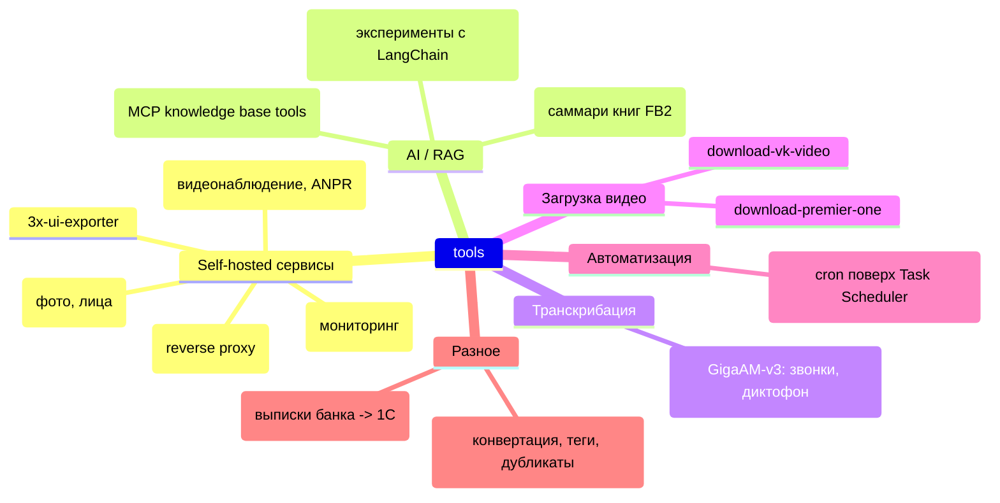

# tools

Коллекция самостоятельных утилит и self-hosted сервисов: домашняя инфраструктура (фото, видеонаблюдение, VPN),
AI/RAG-инструменты, транскрибация аудио, разовые скрипты для конвертации и выгрузки данных.

Каждая папка — независимый проект со своими зависимостями и (обычно) собственным `README.md`.
Общих правил для агента — смотри `CLAUDE.md` и сабмодуль `claude/`.

## Self-hosted сервисы

| Проект | Описание |
| --- | --- |
| [`immich/`](immich/README.md) | Self-hosted фотохранилище (Docker). Плюс два собственных сервиса: [`face-finder`](immich/face-finder/README.md) — SPA для управления/объединения персон, `face-search` — поиск человека по фото лица (pgvector + Immich ML) |
| [`frigate/`](frigate/README.md) | NVR для IP-камер: детекция объектов, ANPR, бэкап событий в Postgres |
| `nginx/` | Кастомный образ nginx (reverse proxy + dnsmasq/hostapd для роутинга) |
| [`prometheus/`](prometheus/README.md) | Мониторинг: Prometheus + экспортеры (windows_exporter, iperf, internet-access) |
| `3x-ui-exporter/` | Патч entrypoint для `m4l3vich/3x-ui-prometheus-exporter` (совместимость со старыми версиями 3x-ui) |

## AI / RAG

| Проект | Описание |
| --- | --- |
| [`RAG/`](RAG/README.md) | Инструменты работы с базой знаний (`.md`-корпус) поверх ClickHouse + bge-m3, 16 инструментов публикуются по MCP (Streamable HTTP и stdio) |
| [`bReader/`](bReader/README.md) | Разбор книг FB2 на секции и генерация саммари через Ollama |
| `lChain/` | Черновые эксперименты с LangChain (`check_lChain.py`) |

## Транскрибация

| Проект | Описание |
| --- | --- |
| [`transcribe/`](transcribe/README.md) | Транскрибация аудио/видео (звонки, диктофонные записи) на модели **GigaAM-v3**: простая транскрибация, разбивка на блоки, диаризация спикеров, пакетная обработка директорий |

## Загрузка видео

| Проект | Описание |
| --- | --- |
| `download-premier-one/` | Набор `.cmd`-скриптов: скачать видео с premier.one, склеить `.ts`, сконвертировать в `.mp4` |
| `download-vk-video/` | Скачивание видео из VK (заголовки запроса + инструкция со скриншотами) |

## Автоматизация

| Проект | Описание |
| --- | --- |
| [`cron-win/`](cron-win/README.md) | PowerShell-скрипт, синхронизирующий `crontab.txt`-файлы (в стиле unix cron) с задачами Windows Task Scheduler |

## Разное

| Проект | Описание |
| --- | --- |
| `py/` | Отдельные скрипты: конвертация FB2 в текст с саммари (`ai_read_book.py`), простановка тегов в Google Photos, поиск дубликатов файлов, удаление водяных знаков, PDF -> PNG, превью-картинки |
| `raif.xml-to-1c/` | XSLT-трансформация выписки Райффайзенбанка (XML) в формат 1С (`1CClientBankExchange`) |

## Документация и отчёты

- `.ai/` — отчёты агента о крупных изменениях (`YYYYMMDD.NNN_название.md`), см. правила в `CLAUDE.md`
- `claude/` — сабмодуль с общими правилами для AI-агента (`CLAUDE.base.md`, `CLAUDE.python.md`)
- `001_farewell_copilot.md` — заметка про переход с GitHub Copilot на Claude